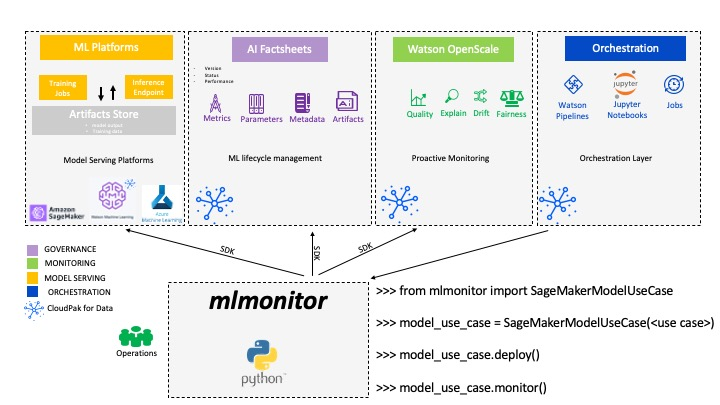
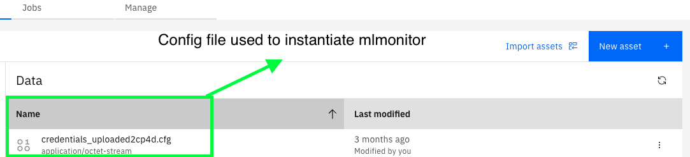
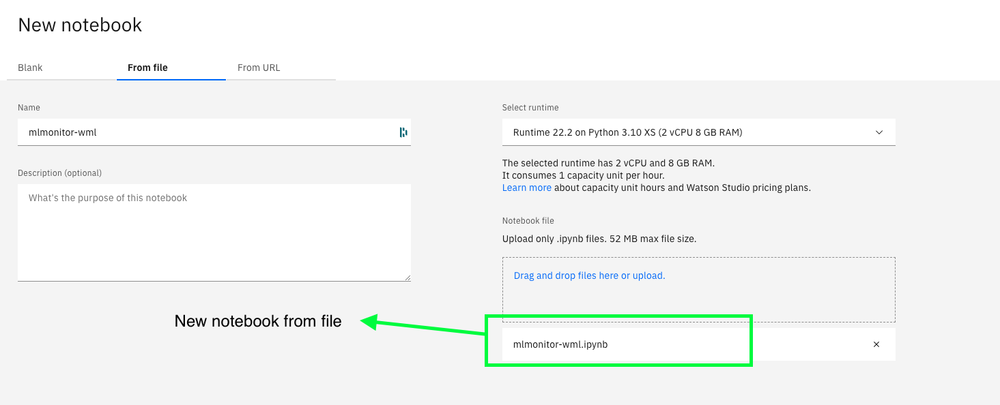

# A tool to better orchestrate model deployments and monitoring

This repository enables you to operationalize **ML models in AWS,Azure and IBM Cloud Pak for Data** and enable **model monitoring in Watson OpenScale** in minutes.

it includes a collection of model use cases ready to be trained and deployed with these model serving platforms.

These models are using **AI FactSheets** for model metadata capture and allow you to seamlessly experiment the AI governance capabilities of Cloud Pak for Data on SaaS or on-prem (>4.7).

## 1. Purpose - Automation of MLOps process

The purpose of mlmonitor is two-fold:

increase the productivity of data scientists by letting them focus their effort on building models while automating resource provisioning with declarative configuration files.

Imagine you are responsible to deploy an ML pipeline in production. This model is the result of several months of work and experimentation conducted by a data science team and SMEs. This model passed the model validation phase and was handed over to your team, they are counting on you!

1. What information should be exchanged between these teams?
2. What are the relevant artifacts needed?

Managing the information exchange during this process is key to avoid delays and failures.

On the one hand, model development teams must provide enough context about their model to capture:

* Model training (retraining), preprocessing and inference code
* Hyperparameters and configuration
* Model binary location and format
* Runtime environment
* Dependencies and specific versions
* Model consumption documentation, output format
* Code and datasets for testing scenarios
* Monitoring strategy and alert thresholds

On the other hand, as an operations team member, you must be able to integrate seamlessly with various services and invoke them from one central place to coordinate the model onboarding process. You will need to resolve technical challenges by using orchestration tools, SDKs and services to streamline this process.

## 2. How to use mlmonitor

mlmonitor python module leverages a wide variety of SDKs to automate deployment tasks.
It can be executed inside [notebook jobs](https://www.ibm.com/docs/en/cloud-paks/cp-data/4.6.x?topic=jobs-creating-in-notebook-editor) or [Watson pipelines](https://medium.com/ibm-data-ai/automating-the-ai-lifecycle-with-ibm-watson-studio-orchestration-flow-4450f1d725d6) jobs or used as a standalone library to quickly setup custom demos.
The end goal is to accelerate, standardize and breakdown deployment flows into repeatable tasks.



## 3. Prerequisites - IBM Cloud Lite services

More step-by-step instructions on Prerequisites [here](./documentation/README_prerequisites.md)

Please make sure you have done the following before following the subsequent steps:

1. Cloud Object Storage
2. CP4D with Watson OpenScale and Watson Studio and Watson Machine Learning
3. AI FactSheets Model entries
4. AWS Sagemaker Account for SageMakerModelUseCase (optional)
5. Azure Account for AzureModelUseCase (optional)


## 4. *mlmonitor* as a standalone library :

1. Install *mlmonitor* library and follow these [documentation](./mlmonitor/README.md)
2. Demonstrate and scale [custom monitors in Watson OpenScale](./mlmonitor/custmonitor/README.md)

For quickstarts follow next sections

## 5. *mlmonitor* - install from Pypi

mlmonitor is currently released on test Pypi and can be installed as follow :

* from a Waston studio environment

```bash
pip install mlmonitor
```

* from a local and fresh python environment add `local` extra requirement

```bash
pip install mlmonitor[local]
```

* if you need to configure drift monitors add `drift` extra requirement to the install command [drift]

* if you need to onboard a SageMaker model add `sagemaker` extra requirement to the install command [sagemaker]

* if you need to onboard an Azure model monitor add `azure` extra requirement to the install command [azure]

**Note :** this will install `azureml-sdk` on your environment
it is possible to add several extra requirements at once e.g [local,drift]


## 6. *mlmonitor* - notebook examples (run from local code)

This section helps you to run mlmonitor from this repo by running notebook examples

- [WML notebook](./examples/mlmonitor-wml.ipynb)
- [SageMaker notebook](./examples/mlmonitor-sagemaker.ipynb)
- [Azure notebook](./examples/mlmonitor-azure.ipynb)

## 7. *mlmonitor* - test container

This section builds a wheel file from this repo and install it in [python container image](https://hub.docker.com/_/python)

* Build mlmonitor container [Dockerfile](./Dockerfile)

```bash
make docker VERSION=<your version>
```

* Run this container in interactive mode (run from  code)

specify the path to your config file following [this format](./mlmonitor/credentials_example.cfg) or see [documentation](./mlmonitor/README.md) for more details.

```bash
make run CONFIG_FILE=<path to your config file> VERSION=<your version>
```

* Run python command and execute the sequence of steps to onboard a new model described in [this notebook](./examples/mlmonitor-wml.ipynb) :

```bash
root@109a4c2052f8:/# python
Python 3.10.12 [GCC 12.2.0] on linux
Type "help", "copyright", "credits" or "license" for more information.
>>> from mlmonitor import WMLModelUseCase
- ibm_watson_machine_learning.client - __init__ -INFO - Client successfully initialized
pip install mlmonitor[azure] to use AzureModelUseCase
- matplotlib.font_manager - _load_fontmanager -INFO - generated new fontManager
pip install mlmonitor[sagemaker] to use SageMakerModelUseCase
pip install mlmonitor[azure] to use AzureModelUseCase
>>> catalog_id = 'xxxxxxxxxxxxxxxxx'
>>> source_dir = 'use_case_gcr'
>>> model_entry_id='xxxxxxxxxxxxxxxxx'
>>> wml_model_uc = WMLModelUseCase(source_dir=source_dir, catalog_id=catalog_id, model_entry_id=model_entry_id)
>>> wml_model_uc.train()
>>> wml_model_uc.deploy()
```

## 8. *mlmonitor* - in Watson Studio

### 8.1 Create a CP4D project

Create a CP4D project in Cloud Pak for Data and make sure Watson Studio and Watson Machine Learning services are installed.

### 8.2 Upload config file as Data Asset

Generate credential file and upload it as a data asset into your project.

- [credentials_uploaded2cp4d.cfg](./mlmonitor/credentials_example.cfg) following _mlmonitor_ configuration [instructions](./mlmonitor/README.md) section 2.1



Notebook assets created in section 1.3 reads the config file (data asset) to instantiates *mlmonitor* python library

### 8.3 Create a Notebook Asset from file

Create a Jupyter Notebook in Watson Studio from one of this 3 `ipynb` files.

- [WML notebook](./examples/mlmonitor-wml.ipynb)
- [SageMaker notebook](./examples/mlmonitor-sagemaker.ipynb)
- [Azure notebook](./examples/mlmonitor-azure.ipynb)




## 9. Demonstrating drift monitoring capabilities with *mlmonitor*

To showcase the Machine Learning monitoring capabilities of Watson OpenScale, *mlmonitor* comes with pre-defined drift scenarios. Inside each use cases, a `model_perturbation.json` file defines the different drift scenarios availale. As shown below, the `.data_drift_scenario()` method can be ran with default settings or can be modified using `ModelPerturbator` object.

```
# Use default settings
model_uc.data_drift_scenario()

# Use pre-defined scenario and changing the ratios parameters
model_perturbation = ModelPerturbator(
        source_dir=source_dir,
        monitor_type='drift',
        scenario_id='single_column_1',
    )

model_perturbation.ratios = [0.1, 0.2, 0.3, 0.1, 0.4, 0.1]

model_uc.data_drift_scenario(model_perturbation)
```

*Currently only the GCR use case is supported.
