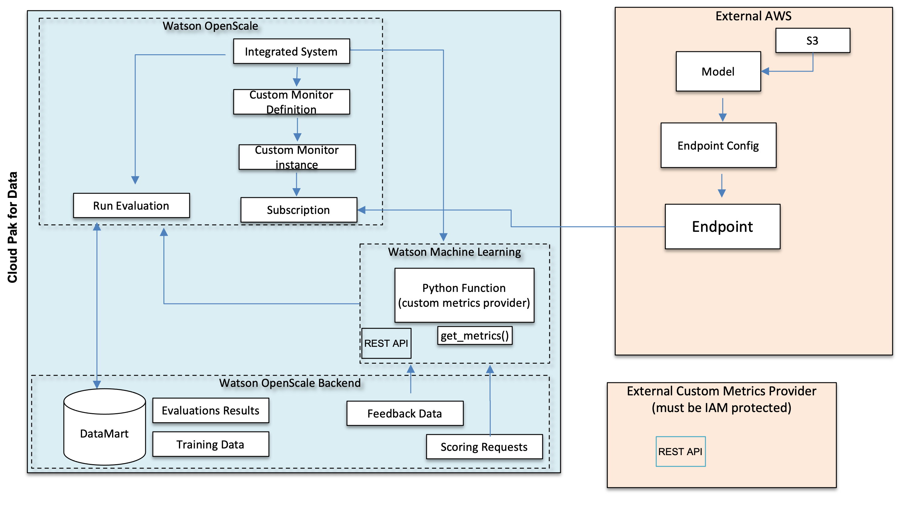
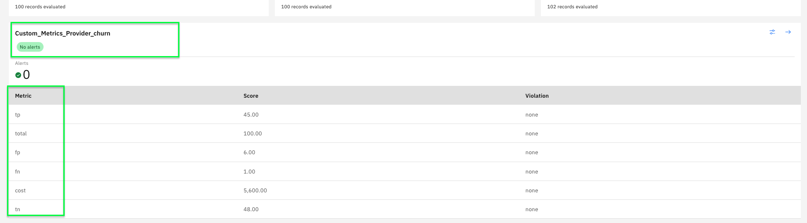

# Custom Monitors with Watson OpenScale

This library helps to abstract the complexity of publishing and maintaining Custom Monitors in Watson OpenScale.

It is a good opportunity to share and maintain a richer set of metrics and publish best practices collecting data.

Then , high level steps to create a new custom monitor instance are as follows :

- Create a software package and software component in Watson Machine Learning with `custmonitor` installed
- Deploy a function in WML with this runtime that runs [metrics computation code](./metrics)
- Create a Custom Monitor in Watson OpenScale invoking this WML function endpoint.

### 1.1 Custom Monitors architecture

This architecture diagram shows the internal definition of a custom monitor in Watson OpenScale :

* `Integrated System`: Definition of external system of type "custom_metrics_provider" with credentials and endpoint.
* `Custom Monitor Definition`: Definition of Custom Metrics names and thresholds.
* `Custom Monitor instance`:  instantiate a custom monitor and associate integrated_system_id and monitor_definition_id.
* `Custom metrics provider`:  Deployment responsible to report metrics to the Custom Monitor instance.




* step 1 => Creation of custom metrics provider: [mlmonitor.src.wml.deploy_custom_metrics_provider.deploy_custom_metrics_provider](../../mlmonitor/src/wml/deploy_custom_metrics_provider.py)

* step 2 => Creation of custom monitor : [mlmonitor.src.configure_custom_monitor.configure_custom_monitor](mlmonitor/src/wos/configure_custom_monitor.py)

### 1.2 Custom Monitors workflow


### 2 How to deploy a custom monitor

Refer to [this notebook](../../examples/custom_monitors.ipynb) to run the complete procedure.

you should specify model deployment name `monitored_model` for which a custom monitor should be created and the model use case it belongs to with `source_dir`.

Run all cells until `Delete Custom Monitor`

```python
source_dir = 'use_case_churn'
#source_dir = 'use_case_gcr'
# Model for which the Custom monitor is attached (via subscription)
# monitored_model should be consistent with source_dir (e.g churn models if source_dir = 'use_case_churn' )
monitored_model = "sm-cc-xgboost-2022-11-26-14-17-37-234 "
#monitored_model = "sm-gcr-scikit-2022-12-03-05-43-18-802"
```

Custom metrics definition is located in `source_dir` directory in `custom_monitor` section of [model_signature.py](../../mlmonitor/use_case_churn/model_signature.json)

Example of custom monitor definition for Custom churn model use case included in model signature :
```json
custom_monitor = {
    "enabled": True,
    "names": ["tp", "fp", "tn", "fn", "cost", "total"],
    "thresholds": [200, 10, 200, 10, 6000, 200],
    "provider_name": "Custom_Metrics_Provider_churn",
    "custom_monitor_name": "Custom_Metrics_Provider_churn",
    "wml_function_provider": "Custom_Metrics_Provider_Deployment_churn",
}
```

### 2.1 Build `custmonitor`

*customonitor* package is built to be included in a WML software package.

```
python /custmonitor/setup.py sdist --formats=zip

creating 'dist/custmonitor-0.x.zip'
```

### 2.2 Create a software package

with [mlmonitor.wml.package](../../mlmonitor/src/wml/package.py).create_package_extension create a new package extension in WML with `dist/custmonitor-0.x.zip` file built at the previous step.

### 2.3 Create a software component

with [mlmonitor.wml.package](../../mlmonitor/src/wml/package.py). create_software_specification_extension create a new software specification in WML with the previously created ackage extension.

### 2.4 Deploy a function in WML with this runtime

Deploy custom metrics provider using previously created software component as runtime a `custom_metrics_provider` code to get metrics.

```python
deploy_custom_metrics_provider(deployment_name=deployment_name,
                               function_code=custom_metrics_provider,
                               wml_space_id=WML_SPACE_ID,
                               python_function_name=py_fname,
                               runtime=f"custmonitor-{version}")
```

verify in deployment space that you have a deployment and function for the specified custom metrics provider :


### 2.5 create a Custom Monitor in Watson OpenScale

Create a Custom Monitor as

```python
custom_monitor_config = {
'monitored_model':monitored_model.strip(),
 'wos_client':wos_client,
 'wml_client':wml_client,
 'deployment_name':deployment_name,
 'provider_name':provider_name,
 'custom_monitor_name':custom_monitor_name,
 'custom_metrics_names':custom_metrics_names,
 'custom_metrics_thresholds':custom_metrics_thresholds,
 'wml_space_id':WML_SPACE_ID,
 'apikey':API_KEY,
 'auth_url':IAM_URL
}
custom_monitor_instance_details = configure_custom_monitor(**custom_monitor_config)

INFO - Successfully finished deployments for url: 'https://us-south.ml.cloud.ibm.com/ml/v4/deployments?version=2021-06-24&space_id=c47809c5-b3f5-4082-bb5c-509c052fa61d&limit=200'
INFO - IntegratedSystems created with name Custom_Metrics_Provider_churn with id 77b75292-d015-4e90-aa91-774e16c0489c
INFO - WML function deployed for this custom monitor [{deployment_name}]
Subscription ID [73da70f0-745f-43c6-86ce-a0134aab570f]
Provider Name [Custom_Metrics_Provider_churn] to create
Scoring url for WML function [https://us-south.ml.cloud.ibm.com/ml/v4/deployments/f16e871f-e207-4dbc-88ea-85063ddd5189/predictions?version=2022-10-11]
Monitored model Name [sm-cc-xgboost-2022-11-26-14-17-37-234]
Data Mart ID [3f2c1b4b-4230-45d4-8cc3-43b1b7a5274a]
custom_monitor_name [Custom_Metrics_Provider_churn]
```

Verify in WOS OpenScale subscription that there is a custom monitor for the `monitored_model` value with the defined metric names.



### 2.6 Perform Payload or Feedback logging for monitor endpoint

```python
from mlmonitor.src.wos.run_feedback_logging import log_feedback_data

log_feedback_data(
    source_dir=source_dir,
    deployment_name=monitored_model.strip(),
    deployment_target='aws',
    inference_samples=100,
    include_predictions=False,
)

== == == == == == == == == == == == == == == == == == == == == == == == == == == == == == == == == == == == == == == == == == == == ==

pending
active

---------------------------------------
Successfully
finished
storing
records
---------------------------------------

```


### 2.7 Run periodic evaluations on custom monitor

```python
from mlmonitor.src.wos.evaluate import evaluate_monitor
from mlmonitor.src import PROJECT_ROOT

evaluate_monitor(
    deployment_name=monitored_model.strip(),
    monitor_types=(custom_monitor_name.strip().lower(),),
    output_model_data=PROJECT_ROOT,
)


== == == == == == == == == == == == == == == == == == == == == == == == == == == == == == == == == == == ==

Waiting
for end of monitoring run 8bf41a7d-7ac3-482f-9728-87d605882922

== == == == == == == == == == == == == == == == == == == == == == == == == == == == == == == == == == == ==

running

---------------------------
Successfully
finished
run
---------------------------

```

### 2.8 Delete custom monitor

Refer to [this notebook](../../examples/custom_monitors.ipynb) to delete a custom monitor.

Run all cells after  `Delete Custom Monitor`
