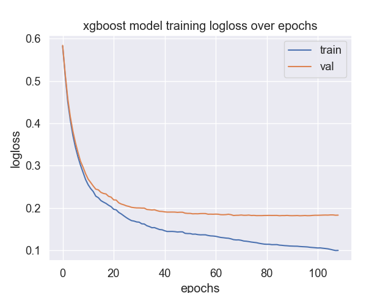
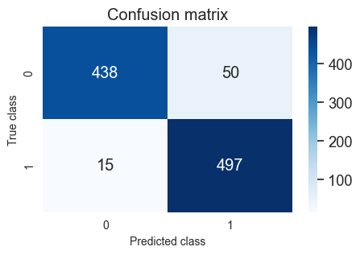
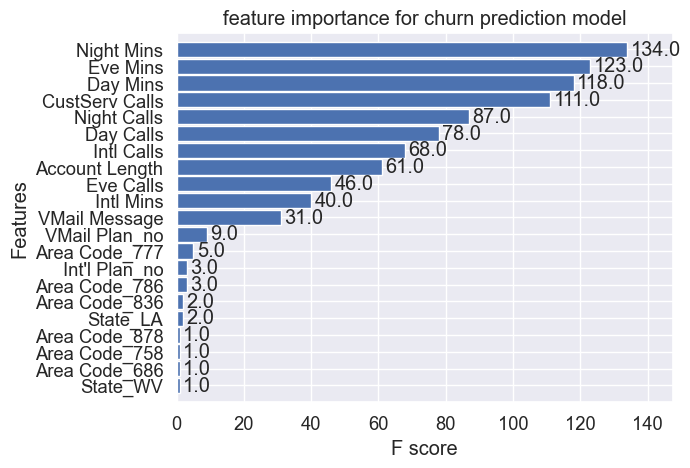
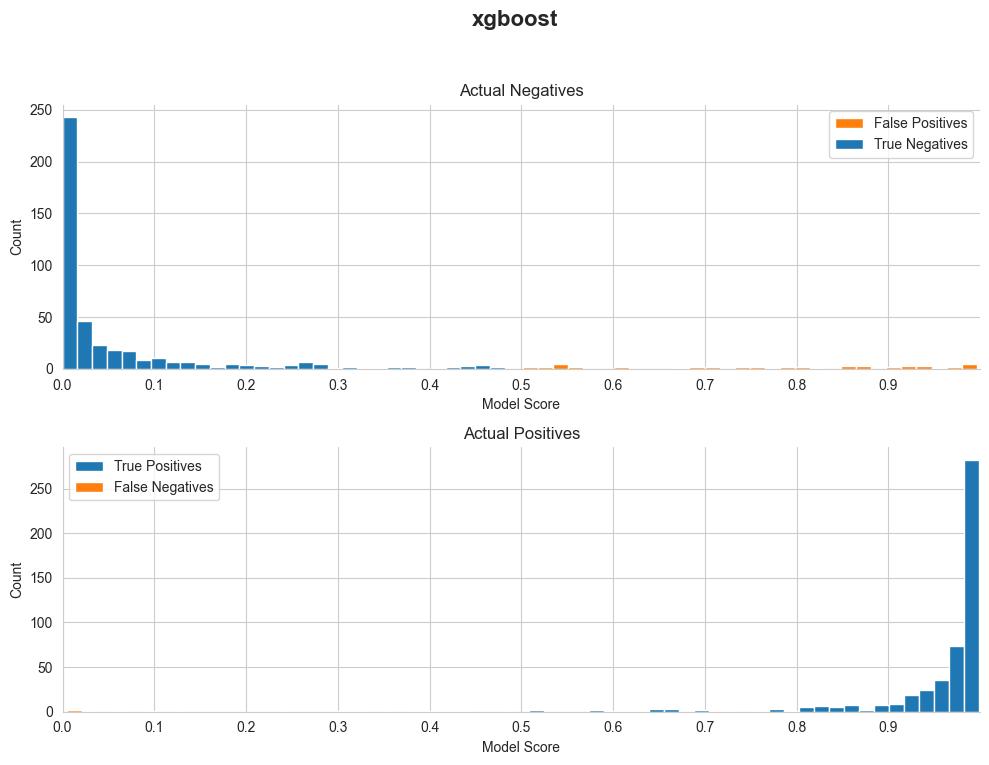
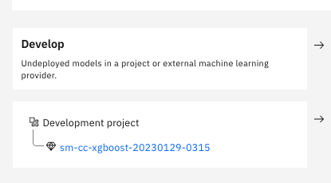
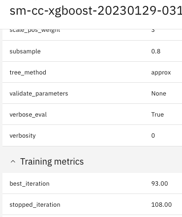

# Customer Churn model use case

## 1. Model Training & Scoring on local environment

How to run training and inference in local environment ?

a - create a special virtual environment _venv-use-case-churn_

- python virtual env venv-use-case-churn for local training and inference can be created as follow
```bash
$ cd <GitHub-directory>
$ python -m venv venv-use-case-churn
$ source venv-use-case-churn/bin/activate
(venv-use-case-churn)
$ pip install -r ./mlmonitor/use_case_churn requirements.txt
$ pip install -r ./mlmonitor/use_case_churn requirements-local.txt
```

Note :

- `use_case_churn` directory is shipped when training and inference is performed in Sagemaker - all dependencies in _requirements.txt_ file are installed in Sagemaker containers.
- dependencies in requirements-local.txt are meant to be installed only in local environment.

b - set the following environment variables in .env file in use_case_churn directory :

- `AWS_ACCESS_KEY_ID`: `AKIAXXXXX` your aws key

- `AWS_SECRET_ACCESS_KEY`: `XXXXXX` your credentials

- `AWS_DEFAULT_REGION`: `ca-central-1` your aws region

- `API_KEY` : `XXXXXX` your CP4D credentials

**Example : train model locally** :

```bash
(venv-use-case-churn)
$ cd <GitHub-directory>/mlmonitor
$ python ./use_case_churn/test_train.py --catalog-id <my catalog id>  --model-entry-id <my model-entry id>

Experiment sm-cc-xgboost-20230129-0315 does not exist, creating new experiment
Experiment successfully created with ID 1 and name sm-cc-xgboost-20230129-0315
Autolog enabled Successfully
Current Experiment sm-cc-xgboost-20230129-0315 ID 1

[0]	validation_0-logloss:0.58226	validation_1-logloss:0.58394
[1]	validation_0-logloss:0.51249	validation_1-logloss:0.51661
[2]	validation_0-logloss:0.45071	validation_1-logloss:0.45854
[8]	validation_0-logloss:0.28425	validation_1-logloss:0.29654
[28]	validation_0-logloss:0.16931	validation_1-logloss:0.20094
[106]	validation_0-logloss:0.10109	validation_1-logloss:0.18385

2023/01/28 22:15:24 INFO : logging results to factsheet for run_id 280e36ca7d674f2d8bed9d0cc9283eb8
2023/01/28 22:15:26 INFO : Successfully logged results to Factsheet service for run_id
Confusion Matrix
[[438  50]
 [ 15 497]]
precision 0.9085 / recall 0.970
FPR 0.769
f1 0.938
F1  test : 0.938
Acc test : 0.935
Prec test : 0.908
Rec test : 0.970

{'prec': 0.9085923217550275, 'acc_test': 0.935, 'recall_test': 0.970703125, 'tp': 497, 'fp': 50, 'tn': 438, 'f1': 0.9386213408876298, 'fn': 15, 'rec': 0.970703125, 'fpr': 0.7692307692307693, 'F1  test': 0.9386213408876298, 'Acc test': 0.935, 'Prec test': 0.9085923217550275, 'Rec test': 0.970703125}
runs :                              run_id  ...                         end_time
0  280e36ca7d674f2d8bed9d0cc9283eb8  ... 2023-01-29 03:15:26.271000+00:00
Current RunID 280e36ca7d674f2d8bed9d0cc9283eb8
2023/01/28 22:15:28 INFO : Initiating logging to factsheet for run_id......280e36ca7d674f2d8bed9d0cc9283eb8
```

* The following figures are generated :

  | 1.Train/Val Loss                            |                  2. Confusion Matrix                  |                3. Feature Importance                |                    4. Probabilities                    |
|---------------------------------------------|:-----------------------------------------------------:|:---------------------------------------------------:|:------------------------------------------------------:|
  |  |  |                                 |  |

* One Factsheets model asset should be generated in Model use case specified by `--model-entry-id` parameter:

  | 1.develop state                                      |              2. training metadata            |
  |------------------------------------------------------| :--------------------------------------------: |
  |  |  |


* trained model is stored locally in [models](../models) folder ***model_local.tar.gz*** and should have been uplaoded to s3 bucket.

**Example : test inference locally  :**

```bash
(venv-use-case-churn)
$ cd <GitHub-directory>/use_case_churn//mlmonitor
$ python ./use_case_churn/test_inference.py

INFO:use_case_churn.inference_cc_sk:output_fn return application/json response :
{'predictions': [{'predicted_label': 1, 'score': 0.97}, {'predicted_label': 1, 'score': 0.996}]}
INFO:use_case_churn.inference_cc_sk:Called input_fn application/json
INFO:use_case_churn.inference_cc_sk:{"instances": [{"features": []}, {"features": []}]}
INFO:use_case_churn.inference_cc_sk:output_fn received [[0.03024101 0.969759  ]
```

## 2. use mlmonitor to "onboard" a new Model

Once training and inference scripts have been validated in local environment, they will be used in Sagemaker training jobs and inference containers to serve an online model endpoint.

For these tasks such as deploy, monitor,govern,evaluate use _venv-mlmonitor_ virtual environment created earlier [here](../Readme.md).

Make sure to run specify in `MONITOR_CONFIG_FILE` environment variable the path to [credentials.cfg](../../credentials.cfg) file in .env file :

if you don't specify a config file , please set the following environment variables (e.g for container):

- `API_KEY`
- `AUTH_ENDPOINT`
- `AWS_ROLE`
- `MODEL_ENTRY_ID`
- `CATALOG_ID`
- `COS_RESOURCE_CRN`
- `COS_ENDPOINT`
- `BUCKET_NAME`
- `IAM_URL`

**Example : train sagemaker job**
```bash
$ source venv-mlmonitor/bin/activate
(venv-mlmonitor)
$ python
Python 3.10.6
>>> from mlmonitor import SageMakerModelUseCase
>>> source_dir = 'use_case_churn'
>>> catalog_id = <catalog id>
>>> model_entry_id = <Model use case id for churn models>
>>> model_use_case = SageMakerModelUseCase(source_dir,catalog_id,model_entry_id)
>>> model_use_case.train()

INFO - Creating training-job with name: sm-cc-xgboost-2023-01-27-19-10-31-907
Starting - Starting the training job...
2023-01-27 19:14:02 Uploading - Uploading generated training model

INFO - Model artifact produced by training job s3://sagemaker-ca-central-1-977158250528/sagemaker/DEMO-xgboost-churn/sm-cc-xgboost-2023-01-27-19-10-31-907/output/model.tar.gz

>>> model_use_case.display_states()

              - trained:   [True]
              - deployed:  [False]
              - governed:  [False]
              - monitored: [False]
```

**Example : deploy aws endpoint**

```bash
(venv-mlmonitor)
>>> model_use_case.deploy()

INFO - Deploying inference Endpoint sm-cc-xgboost-2023-01-27-19-10-31-907 to AWS
------!
INFO - Raw Predictions received for 2 samples:
{'predictions': [{'predicted_label': 1, 'score': 0.996}, {'predicted_label': 1, 'score': 1.0}]}

>>> model_use_case.display_states()

              - trained:   [True]
              - deployed:  [True]
              - governed:  [False]
              - monitored: [False]
```

**Example : govern this model endpoint in AI Factsheets**

```bash
(venv-mlmonitor)
>>> model_use_case.govern()

INFO : Successfully logged results to Factsheet service for run_id under asset_id: 76d6b

>>> model_use_case.display_states()

              - trained:   [True]
              - deployed:  [True]
              - governed:  [True]
              - monitored: [False]
```

**Example : score sagemaker endpoint**

```bash
(venv-mlmonitor)
>>> model_use_case.score_model()
response_time 229ms
{'fields': ['predicted_label', 'score'], 'values': [[1, 0.996], [1, 1.0], [0, 0.663]]}
```

**Example : create WOS subscription for churn model running in AWS**

```bash
(venv-mlmonitor)
>>> model_use_case.monitor()

---------------------------------------
 Monitor instance successfully created
---------------------------------------

>>> model_use_case.display_states()

              - trained:   [True]
              - deployed:  [True]
              - governed:  [True]
              - monitored: [True]
```

**Example : run payload logging**

```bash
(venv-mlmonitor)
>>> model_use_case.log_payload()

---------------------------------------
 Successfully finished storing records
---------------------------------------
```

**Example : create quality monitor **

```bash
(venv-mlmonitor)
>>> model_use_case.configure_quality_monitor()

---------------------------------------
 Monitor instance successfully created
---------------------------------------

{'quality': 'e6605340-8798-44b5-a538-783ac658701a', 'mrm': '3c234d2d-308e-4d88-a5ca-44efabfc9492'}
```

**Example : run feedback logging **

```bash
(venv-mlmonitor)
>>> model_use_case.log_feedback()

---------------------------------------
 Successfully finished storing records
---------------------------------------
```

**Example : create fairness monitor **

```bash
(venv-mlmonitor)
>>> model_use_case.configure_fairness_monitor()

---------------------------------------
 Monitor instance successfully created
---------------------------------------

{'fairness': '677def01-85cb-4896-a798-8391752ecf2f', 'quality': 'e6605340-8798-44b5-a538-783ac658701a', 'mrm': '3c234d2d-308e-4d88-a5ca-44efabfc9492'}
```

**Example : create drift monitor**

```bash
(venv-mlmonitor)
>>> model_use_case.configure_drift_monitor()

---------------------------------------
 Monitor instance successfully created
---------------------------------------

{'fairness': '677def01-85cb-4896-a798-8391752ecf2f', 'quality': 'e6605340-8798-44b5-a538-783ac658701a', 'mrm': '3c234d2d-308e-4d88-a5ca-44efabfc9492','drift':'949da7b7-5b8b-4dc3-bdcb-c73efcaad7eb'}
```

**Example : create explainability monitor**

```bash
(venv-mlmonitor)
>>> model_use_case.configure_explainability_monitor()

---------------------------------------
 Monitor instance successfully created
---------------------------------------

```

**Example :Evaluate models in Watson Openscale**
```bash
(venv-mlmonitor)
>>> model_use_case.evaluate()
========================================================================

 Waiting for end of monitoring run afa4fa7c-145f-45f6-872e-a8865b532c7e

========================================================================

```
