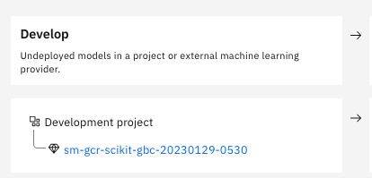
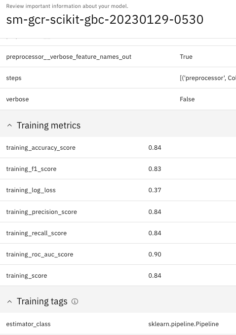
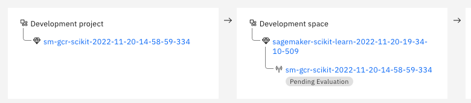
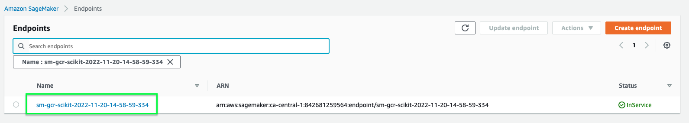
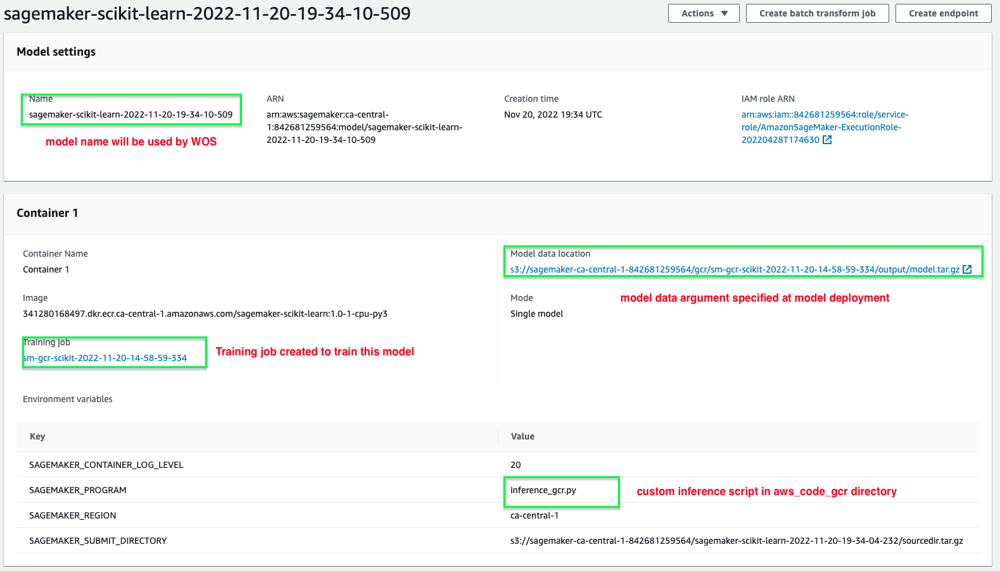
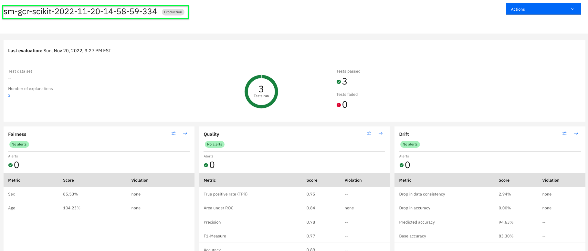
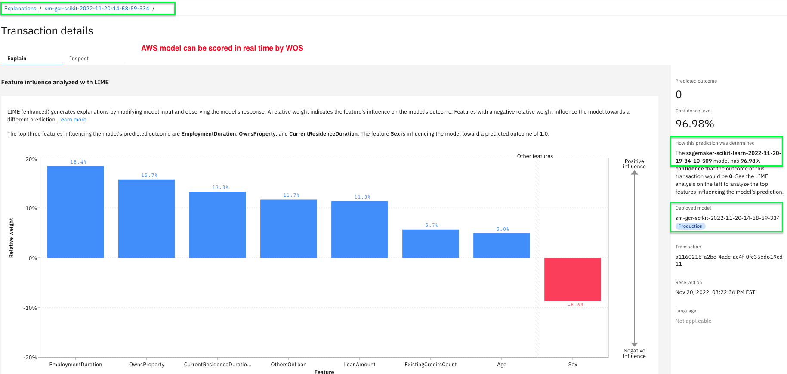
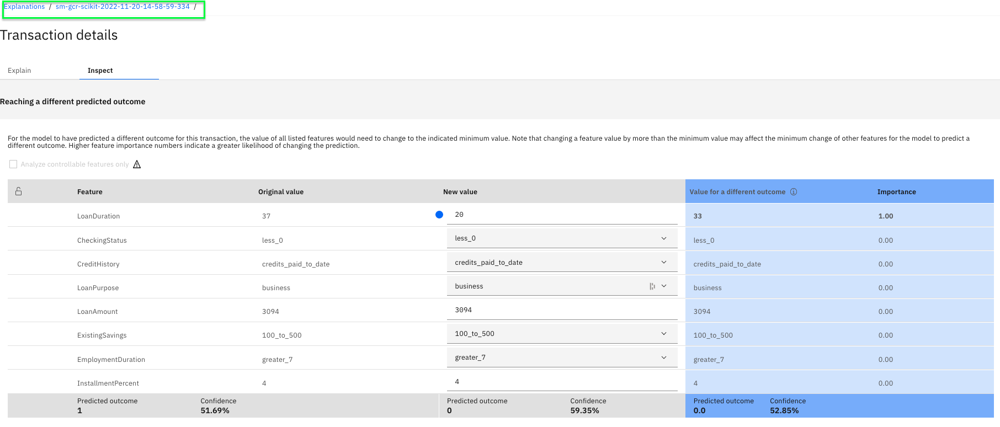
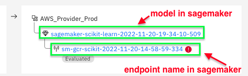
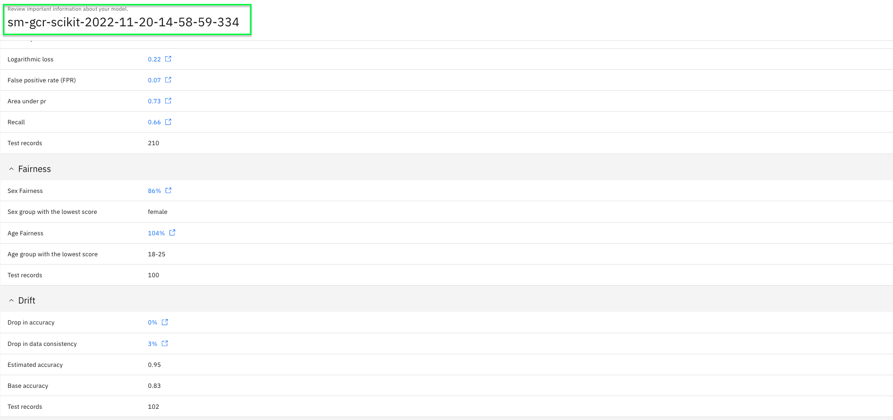

# German Credit Risk model use case

## 1. Model Training & Scoring on local environment

Make sure to run each script within this project's virtual environment and to set the following environment variables :

a - create a special virtual environment _venv-use-case-gcr_

- python virtual env venv-use-case-gcr for local training and inference can be created as follow
```bash
$ cd <GitHub-directory>
$ python -m venv venv-use-case-gcr
$ source venv-use-case-gcr/bin/activate
(venv-use-case-gcr)
$ pip install -r ./mlmonitor/use_case_gcr requirements.txt
$ pip install -r ./mlmonitor/use_case_gcr requirements-local.txt
```

Note :

- `use_case_gcr` directory is shipped when training and inference is performed in Sagemaker - all dependencies in _requirements.txt_ file are installed in Sagemaker containers.
- dependencies in requirements-local.txt are meant to be installed only in local environment.

b - set the following environment variables in .env file in use_case_gcr directory :

- `AWS_ACCESS_KEY_ID`: `AKIAXXXXX` your aws key

- `AWS_SECRET_ACCESS_KEY`: `XXXXXX` your credentials

- `AWS_DEFAULT_REGION`: `ca-central-1` your aws region

- `API_KEY` : `XXXXXX` your CP4D credentials

**Example : train model locally** :

- *catalog-id* and *model-entry-id* are be set as script arguments , they are needed to collect model metadata using AI Factsheets.Since AWS models are external models , it requires a *catalog-id* and *model-entry-id* in WKC.
- models trained locally are stored in  ***mlmonitor/models/model_gcr/model.joblib***


```bash
(venv-use-case-gcr)
$ cd <GitHub-directory>/mlmonitor
$ python ./use_case_gcr/test_train.py --catalog-id <my catalog id>  --model-entry-id <my model-entry id>

INFO : Experiment sm-gcr-scikit-gbc-20221120-2126 does not exist, creating new experiment
INFO : Experiment successfully created with ID 17 and name sm-gcr-scikit-gbc-20221120-2126
INFO : Autolog enabled Successfully

              precision    recall  f1-score   support

           0       0.92      0.80      0.86       382
           1       0.55      0.78      0.65       118

    accuracy                           0.80       500
   macro avg       0.74      0.79      0.75       500
weighted avg       0.83      0.80      0.81       500

Current RunID 48b56f09406d4e7aa0e19bea49c896a8
INFO : Initiating logging to factsheet for run_id......48b56f09406d4e7aa0e19bea49c896a8
```

* Once Factsheets model asset should be generated in Model use case specified by `--model-entry-id` parameter:

  | 1.develop state                                   |            2. training metadata             |
  ---------------------------------------------------|:-------------------------------------------:|
  |  |                 |


**Example : test inference locally**

```bash
(venv-use-case-gcr)
$ python ./use_case_gcr/test_inference.py

mlmonitor.use_case_gcr.inference_aws_gcr - INFO - Called input_fn application/json
mlmonitor.use_case_gcr.inference_aws_gcr - INFO - Called predict_fn
INFO - predictions
INFO - output_fn:
[{'predicted_label': 0, 'score': 0.5459136954990889}, {'predicted_label': 0, 'score': 0.681705567760613}]}

```

## 2. use mlmonitor to "onboard" a new Model

Once training and inference scripts have been validated in local environment, they will be used in Sagemaker training jobs and inference containers to serve an online model endpoint.

For these tasks such as deploy, monitor,govern,evaluate use _venv-mlmonitor_ virtual environment created earlier [here](../Readme.md).

Make sure to run specify in `MONITOR_CONFIG_FILE` environment variable the path to [credentials.cfg](../../credentials.cfg) file in .env file :

if you don't specify a config file , please set the following environment variables (e.g for container):

- `API_KEY`
- `AUTH_ENDPOINT`
- `AWS_ROLE`
- `MODEL_ENTRY_ID`
- `CATALOG_ID`
- `COS_RESOURCE_CRN`
- `COS_ENDPOINT`
- `BUCKET_NAME`
- `IAM_URL`

**Example : train sagemaker job**

Execute *python* command terminal once  *venv-mlmonitor* virtual environment is activated.

```bash
$ source <path to virtual envs>/venv-mlmonitor/bin/activate
(venv-mlmonitor)
$ python
Python 3.10.6
>>> from mlmonitor import SageMakerModelUseCase
>>> source_dir = 'use_case_gcr'
>>> catalog_id = <catalog id>
>>> model_entry_id = <Model use case id for credit risk models>
>>> model_use_case = SageMakerModelUseCase(source_dir,catalog_id,model_entry_id)
>>> model_use_case.train()

INFO - Creating training-job with name: sm-gcr-scikit-2022-11-20-14-58-59-334
Starting the training job...ProfilerReport-1674971701: InProgress

INFO - Model artifact produced by training job s3://sagemaker-ca-central-1-970000000000/gcr/sm-gcr-scikit-2022-11-20-14-58-59-334/output/model.tar.gz

>>> model_use_case.display_states()

              - trained:   [True]
              - deployed:  [False]
              - governed:  [False]
              - monitored: [False]
```

- A model asset was created with AI Factsheets client in the Model use case identified by  *catalog-id* and *model-entry-id*
- Relevant model metadata are also written in`model_data.json`file that can be used for subsequent tasks (deployment, monitoring...)

**Example : deploy aws endpoint**

```bash
>>> model_use_case.deploy()

INFO - endpoint name :[sm-gcr-scikit-2022-11-20-14-58-59-334]
ibm key name :[IBM_API_KEY_MLOPS]
model data  :[s3://sagemaker-ca-central-1-977158250528/gcr/sm-gcr-scikit-2022-11-20-14-58-59-334/output/model.tar.gz]
container  :[341280168497.dkr.ecr.ca-central-1.amazonaws.com/sagemaker-scikit-learn:1.0-1-cpu-py3]
region  :[ca-central-1]

INFO - Deploying inference Endpoint sm-gcr-scikit-2022-11-20-14-58-59-334 to AWS
------!
INFO - Raw Predictions received for 2 samples:
{'predictions': [{'predicted_label': 1, 'score': 0.996}, {'predicted_label': 1, 'score': 1.0}]}

>>> model_use_case.display_states()

              - trained:   [True]
              - deployed:  [True]
              - governed:  [False]
              - monitored: [False]
```

**Example : score sagemaker endpoint**

```bash
>>> model_use_case.score_model()
INFO - EndpointName used for inference: sm-gcr-scikit-2022-11-20-14-58-59-334
response_time 229ms
{
	'fields': ['predicted_label', 'score'],
	'values': [
		[0, 0.5522911346039905],
		[1, 0.6745674770729585],
		[0, 0.6471196109203419],
		[0, 0.7238653966266823],
		[1, 0.9583764850136448]
	]
}
```


- Sends payload example to online model

**Example : Update AI Factsheets deployment details **

```bash
>>> model_use_case.govern()

INFO : Successfully logged results to Factsheet service for run_id under asset_id: 76d6b

>>> model_use_case.display_states()

              - trained:   [True]
              - deployed:  [True]
              - governed:  [True]
              - monitored: [False]
```



**Example : Create WOS subscription for credit risk model**

```bash
>>> model_use_case.monitor()

=============================================================================

 Waiting for end of adding subscription f5dec601-d25e-4fd9-8995-d902fd3185ff

=============================================================================

INFO - 0 records in the payload logging table before adding 2
INFO - 2 records in the payload logging table after adding 2

NFO - subscriptions f5dec601-d25e-4fd9-8995-d902fd3185ff created for deployment sm-gcr-scikit-2022-11-20-14-58-59-334
---------------------------------------
 Monitor instance successfully created
---------------------------------------

>>> model_use_case.display_states()

              - trained:   [True]
              - deployed:  [True]
              - governed:  [True]
              - monitored: [True]


                       --- Schema of 4d051f80-b576-4c33-87b7-bebace22d0c7 data set ---
╒══════════════════════════╤══════════════════════════════════════════════════════════════════╤════════════╕
│ name                     │ type                                                             │ nullable   │
╞══════════════════════════╪══════════════════════════════════════════════════════════════════╪════════════╡
│ scoring_id               │ string                                                           │ False      │
├──────────────────────────┼──────────────────────────────────────────────────────────────────┼────────────┤
│ scoring_timestamp        │ timestamp                                                        │ False      │
├──────────────────────────┼──────────────────────────────────────────────────────────────────┼────────────┤
│ deployment_id            │ string                                                           │ False      │
├──────────────────────────┼──────────────────────────────────────────────────────────────────┼────────────┤
│ asset_revision           │ string                                                           │ True       │
├──────────────────────────┼──────────────────────────────────────────────────────────────────┼────────────┤
│ CheckingStatus           │ string                                                           │ True       │
├──────────────────────────┼──────────────────────────────────────────────────────────────────┼────────────┤
│ LoanDuration             │ integer                                                          │ True       │
├──────────────────────────┼──────────────────────────────────────────────────────────────────┼────────────┤
│ CreditHistory            │ string                                                           │ True       │
├──────────────────────────┼──────────────────────────────────────────────────────────────────┼────────────┤
│ LoanPurpose              │ string                                                           │ True       │
├──────────────────────────┼──────────────────────────────────────────────────────────────────┼────────────┤
│ LoanAmount               │ integer                                                          │ True       │
├──────────────────────────┼──────────────────────────────────────────────────────────────────┼────────────┤
│ ExistingSavings          │ string                                                           │ True       │
├──────────────────────────┼──────────────────────────────────────────────────────────────────┼────────────┤
│ EmploymentDuration       │ string                                                           │ True       │
├──────────────────────────┼──────────────────────────────────────────────────────────────────┼────────────┤
│ InstallmentPercent       │ integer                                                          │ True       │
├──────────────────────────┼──────────────────────────────────────────────────────────────────┼────────────┤
│ Sex                      │ string                                                           │ True       │
├──────────────────────────┼──────────────────────────────────────────────────────────────────┼────────────┤
│ OthersOnLoan             │ string                                                           │ True       │
├──────────────────────────┼──────────────────────────────────────────────────────────────────┼────────────┤
│ CurrentResidenceDuration │ integer                                                          │ True       │
├──────────────────────────┼──────────────────────────────────────────────────────────────────┼────────────┤
│ OwnsProperty             │ string                                                           │ True       │
├──────────────────────────┼──────────────────────────────────────────────────────────────────┼────────────┤
│ Age                      │ integer                                                          │ True       │
├──────────────────────────┼──────────────────────────────────────────────────────────────────┼────────────┤
│ InstallmentPlans         │ string                                                           │ True       │
├──────────────────────────┼──────────────────────────────────────────────────────────────────┼────────────┤
│ Housing                  │ string                                                           │ True       │
├──────────────────────────┼──────────────────────────────────────────────────────────────────┼────────────┤
│ ExistingCreditsCount     │ integer                                                          │ True       │
├──────────────────────────┼──────────────────────────────────────────────────────────────────┼────────────┤
│ Job                      │ string                                                           │ True       │
├──────────────────────────┼──────────────────────────────────────────────────────────────────┼────────────┤
│ Dependents               │ integer                                                          │ True       │
├──────────────────────────┼──────────────────────────────────────────────────────────────────┼────────────┤
│ Telephone                │ string                                                           │ True       │
├──────────────────────────┼──────────────────────────────────────────────────────────────────┼────────────┤
│ ForeignWorker            │ string                                                           │ True       │
├──────────────────────────┼──────────────────────────────────────────────────────────────────┼────────────┤
│ predicted_label          │ integer                                                          │ True       │
├──────────────────────────┼──────────────────────────────────────────────────────────────────┼────────────┤
│ score                    │ double                                                           │ True       │
├──────────────────────────┼──────────────────────────────────────────────────────────────────┼────────────┤
│ prediction_probability   │ double                                                           │ True       │
├──────────────────────────┼──────────────────────────────────────────────────────────────────┼────────────┤
│ ProbabilityVector        │ {'containsNull': True, 'elementType': 'double', 'type': 'array'} │ True       │
╘══════════════════════════╧══════════════════════════════════════════════════════════════════╧════════════╛
```

- `use_case_gcr`: `source_dir` contains all `model_signature.json` file used to configue model  monitoring , you can enable and/or update monitors definitions prior to execute `configure_wos_subscription.py`

  here below is an example of Quality monitor configuration :

  ```json
  {
      "enabled": true,
      "parameters": {"min_feedback_data_size": 10},
      "thresholds": [
          {"metric_id": "area_under_roc", "type": "lower_limit", "value": 0.80}
      ]
  }
  ```

**Example : run payload logging**


```bash
>>> model_use_case.log_payload()

NFO - Found PAYLOAD_DATASET_ID for SUBSCRIPTION_ID  "f5dec601-d25e-4fd9-8995-d902fd3185ff" : 4d051f80-b576-4c33-87b7-bebace22d0c7
INFO - Payload data set id: 4d051f80-b576-4c33-87b7-bebace22d0c7
INFO - explicit payload logging with 100 requests.

---------------------------------------
 Successfully finished storing records
---------------------------------------


INFO - 2 records in the payload logging table before adding 100
INFO - 102 records in the payload logging table after adding 100
```

**Example : create quality monitor**

```bash
>>> model_use_case.configure_quality_monitor()

Deployment Name sm-gcr-scikit-2022-11-20-14-58-59-334
subscription_id [f5dec601-d25e-4fd9-8995-d902fd3185ff]
data_mart_id [9ed45db9-23f6-4587-b96c-db91a390b8e2]
Quality Monitor ID [None]
---------------------------------------
 Monitor instance successfully created
---------------------------------------
```

**Example : run feedback logging**

```bash
>>> model_use_case.log_feedback()

INFO - Feedback Logging for sm-gcr-scikit-2022-11-20-14-58-59-334 in aws
INFO - Found feedback_data_set_id for SUBSCRIPTION_ID  "f5dec601-d25e-4fd9-8995-d902fd3185ff" : 22dd98ef-7755-459a-883f-8da73bf6a894
NFO - Feedback data set id:22dd98ef-7755-459a-883f-8da73bf6a894
INFO - explicit feedback logging with 100 requests .

active

---------------------------------------
 Successfully finished storing records
---------------------------------------


2023-01-29 14:24:58,422 - mlmonitor.src - INFO - 0 records in the feedback logging table before adding 100
2023-01-29 14:24:58,422 - mlmonitor.src - INFO - 100 records in the feedback logging table after adding 100
```

**Example : create fairness monitor**

```bash
>>> model_use_case.configure_fairness_monitor()

---------------------------------------
 Monitor instance successfully created
---------------------------------------


{'fairness': '2ab7394c-bea0-4fa0-91d5-45e01e006562', 'quality': 'caf0beb7-26cb-46bd-9d84-cd935142f4f8', 'mrm': '1a875f51-1789-48f1-b062-eaaa36a518b7'}
```

**Example : create drift monitor**

```bash
>>> model_use_case.configure_drift_monitor()

No drift monitor for sm-gcr-scikit-2022-11-20-14-58-59-334

Scoring training dataframe...:   0%|                                                                                                                                                                                                  | 0/4000 [00:00<?, ?rows/s]response_time 469ms
Scoring training dataframe...: 100%|█████████████████| 4000/4000 [00:00<00:00, 5928.47rows/s]
Optimising Drift Detection Model...: 100%|███████████| 40/40 [00:27<00:00,  1.46models/s]
Scoring training dataframe...:   0%|                                                                                                                                                                                                  | 0/1000 [00:00<?, ?rows/s]response_time 261ms
Scoring training dataframe...: 100%|███████████████| 1000/1000 [00:00<00:00, 3048.77rows/s]
Computing feature stats...: 100%|█████████| 20/20 [00:00<00:00, 491.63features/s]
Learning single feature constraints...: 100%|██████████| 21/21 [00:00<00:00, 880.25constraints/s]
Learning two feature constraints...: 100%|███████████| 209/209 [00:01<00:00, 145.35constraints/s]


drift Monitor ID Created [97339461-56ca-4a73-8bc8-838100d34379]

---------------------------------------
 Monitor instance successfully created
---------------------------------------
```

- a drift archive ***drift_detect_mdl_use_case_gcr.tar.gz*** will be generated and used to configure drift monitor.

**Example : Evaluate models in Watson OpensSale**

```bash
>>> model_use_case.evaluate()

---------------------------
 Successfully finished run
---------------------------

INFO - drift Monitor evaluation completed
INFO - Run fairness Monitor evaluation started
INFO - fairness Monitor evaluation completed

INFO - Run quality Monitor evaluation started
INFO - quality Monitor evaluation completed at 29/01/2023 14:30:29
```

- specify which monitor to evaluate by adding flags ***--wos-evaluate-quality***  , ***--wos-evaluate-fairness***  and/or ***--wos-evaluate-drift***
- A minimum required number of samples must be logged prior to perform an evaluation

**Example : Delete all resources created earlier**

```bash
>>> model_use_case.cleanup()

INFO - deleting [aws] resources for [sm-gcr-scikit-2022-11-20-14-58-59-334]...
INFO - Model asset [9f0faaf6-8d8f-459b-a1db-a7919f430f26] for deployment [sm-gcr-scikit-2022-11-20-14-58-59-334] unlinked from catalog_id [d4df90df-809d-4322-9a60-8233fda47be5] model_entry_id [1476eb70-1923-4101-a11a-749e63f6b02c]
INFO - Model asset [9f0faaf6-8d8f-459b-a1db-a7919f430f26] for deployment [sm-gcr-scikit-2022-11-20-14-58-59-334] Deleted
{'serving': 1, 'wos': 1, 'factsheets': 1}
```

Number of resources deleted is returned

- AWS resources are cleanup up properly (Endpoint,Endpoint Config and Model).

- Watson OpenScale subscription is deleted.

- AI Factsheets model assets are removed from Model use case and deleted.

## 3. Expected Outcomes for the German Credit Risk model (e.g model xxxx-334 )

### 3.1 Endpoint should be deployed in AWS



### 2.2 Custom inference script is used by Model



### 3.3  OpenScale Subscription exists with monitors evaluated



### 3.4 Explainability works meaning AWS model can be queried by OpenScale

  |              1.LIME               |              2. Constrastive            |
  | :--------------------------------------------: | :------------------------------------------------: |
  |  |  |

### 3.5 AI Factsheets model asset is Evaluate , in operate state and has evaluation metrics

  |              Operate              |              Monitoring metrics            |
  | :--------------------------------------------: | :------------------------------------------------: |
  |  |  |
