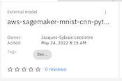
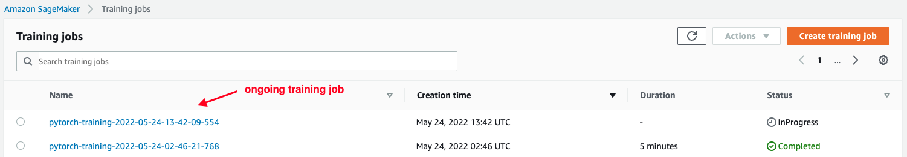
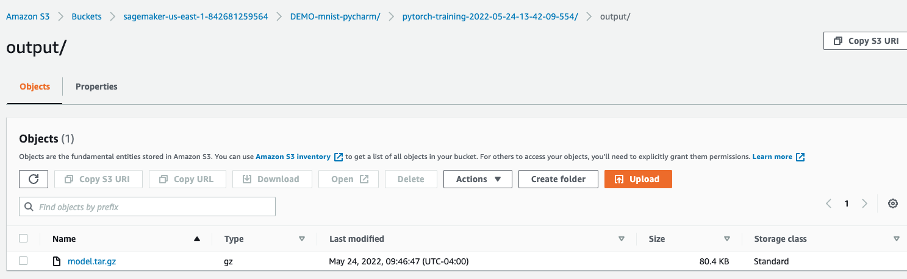
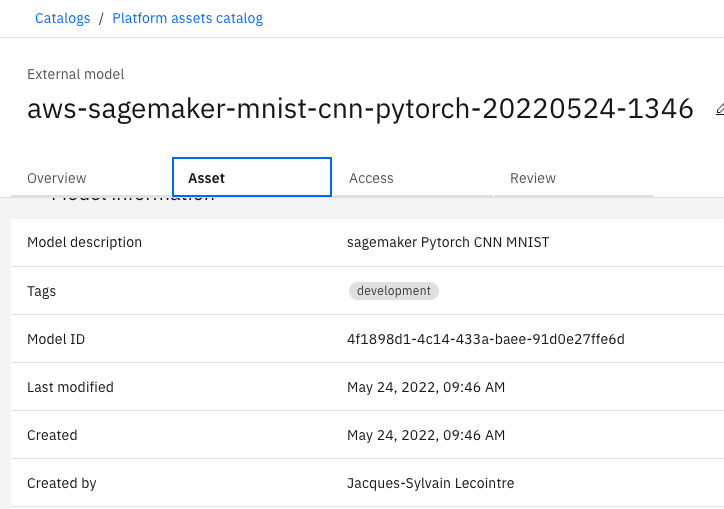
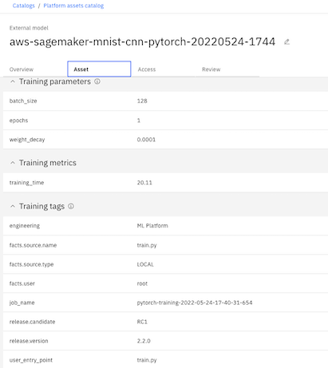
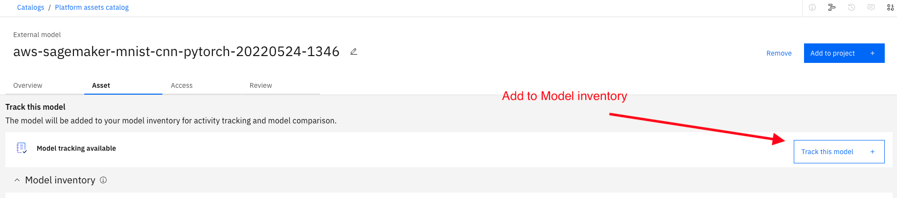
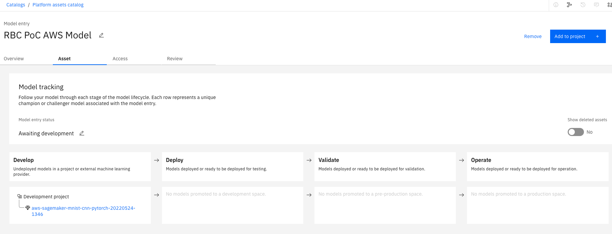
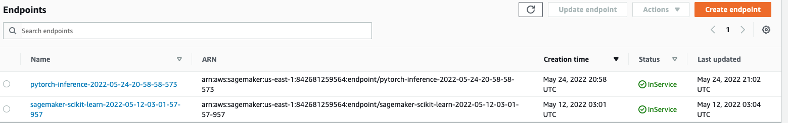
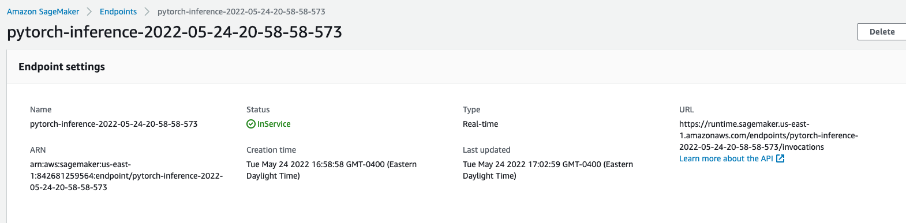

## How to train,deploy in AWS and monitor in WOS Pytorch model on MNIST dataset

### 1. CNN Pytorch model

This is a simple CNN model with 2 conv layers that can be found in [ConvNet](./pt_models.py)

```
PytorchLightning_CNN_MNIST               --                        --
├─CrossEntropyLoss: 1-1                  --                        --
├─ConvNet: 1-2                           [64, 10]                  --
│    └─Conv2d: 2-1                       [64, 10, 24, 24]          260
│    └─Conv2d: 2-2                       [64, 20, 8, 8]            5,020
│    └─Dropout2d: 2-3                    [64, 20, 8, 8]            --
│    └─Linear: 2-4                       [64, 50]                  16,050
│    └─Linear: 2-5                       [64, 10]                  510
├─Accuracy: 1-3
```


## 2. Train Pytorch Model in AWS

The Goal of this model use case is to provide an AI Governance layer to an ML model developed and served externally in AWS Sagemaker.

The first step is to train this ML Model.

Our model is a simple CNN Model or Fully Connected NN model written in Pytorch.

#### 2.1 Train locally

You can Always train models locally prior to run AWS training jobs by invoking [test_train.py](./test_train.py)  as follow with the right parameters to trigger [train.py](./pytorch_train.py) for Pytorch model.

```shell
User in ~/use_case_mnist_pt
# python ./use_case_mnist_pt/test_train.py --model cnn --epochs 10
(venv-ai-gov-rbc)
python /use_case/test_train.py --model pytorch --epochs 2
{'batch_size': 64, 'test_batch_size': 1000, 'epochs': 2, 'learning_rate': 0.001, 'beta_1': 0.9, 'beta_2': 0.999, 'weight_decay': 0.0001, 'seed': 1, 'hidden_size': 64, 'log_interval': 100, 'backend': None, 'model': 'pytorch', 'hosts': ['algo-1'], 'current_host': 'algo-1', 'model_dir': './ai-governance/models', 'train': './ai-governance/data/mnist', 'test': './ai-governance/data/mnist', 'num_gpus': 0}
2022/05/24 08:14:29 INFO :  Experiment aws-sagemaker-mnist-cnn-pytorch-20220524-1214 does not exist, creating new experiment
2022/05/24 08:14:29 INFO : Experiment successfully created with ID 1 and name aws-sagemaker-mnist-cnn-pytorch-20220524-1214
2022/05/24 08:14:29 INFO : Manual tracing initiated successfully under run 1fe942e518344e1b92cc4d82270ad92d
Start training ...
Train Epoch: 1 [6400/60000 (11%)] Loss: 0.903774
Train Epoch: 1 [51200/60000 (85%)] Loss: 0.451619
Train Epoch: 1 [57600/60000 (96%)] Loss: 0.214894
Test set: Average loss: 0.1020, Accuracy: 9690/10000, 96.9)

Train Epoch: 2 [6400/60000 (11%)] Loss: 0.187961
Train Epoch: 2 [51200/60000 (85%)] Loss: 0.070237
Train Epoch: 2 [57600/60000 (96%)] Loss: 0.221082
Test set: Average loss: 0.0732, Accuracy: 9778/10000, 97.78)

Current RunID 1fe942e518344e1b92cc4d82270ad92d
2022/05/24 08:15:05 INFO : External model asset saved successfully under asset_id 62749d34-9b4c-4090-b279-cd06fcc1c374 and catalog 6e846219-9a24-4827-a892-a66697b38b17
2022/05/24 08:15:05 INFO : logging results to factsheet for run_id 1fe942e518344e1b92cc4d82270ad92d
2022/05/24 08:15:07 INFO : Successfully logged results to Factsheet service for run_id 1fe942e518344e1b92cc4d82270ad92d under asset_id: 5f430963-7125-4d2d-9981-e925a9df520b
Saving the model
```


- This is the best way to make sure the training script is working properly within your local virtual environment prior to launch a training job in Sagemaker.

- This script should have generated a new Asset named `aws-sagemaker-mnist-cnn-pytorch-yMD-HM` in factsheets service

  

- Autologging is not supported with Pytorch framework (only with Pytorch Lightning) , therefore facts are captured manually in [train.py](./use_case_mnist/pytorch_train.py) with a Factsheets client instantiated for manual capture : `enable_autolog=False`

  ```python
  facts_client = AIGovFactsClient(api_key=API_KEY,
                                  experiment_name=EXPERIMENT_NAME,
                                  set_as_current_experiment=True,
                                  external_model=True,
                                  enable_autolog=False # Autolog is set to False since nothing will be capture with Pytorch
                                 )

  facts_client.manual_log.start_trace()

  # Manual Capture of Facts
  facts_client.runs.log_metrics(run_id=run_id, metrics={"epochs": args.get('epochs'), "batch_size": args.get('batch_size'),"weight_decay": args.get('weight_decay')})

  # Manual export of Facts
  facts_client.export_facts.export_payload_manual(run_id)
  ```


#### 2.2 Run AWS training job

Run [`train_sagemaker_job.py`](../src/aws/train_sagemaker_job.py) , this will start a Sagemaker Pytorch estimator with the proper training script.

All Python dependencies listed in [requirements.txt](./use_case_mnist_pt/requirements.txt)  will be installed in traning job container included ***ibm-aigov-facts-client*** to collect training facts.

```python
from sagemaker.pytorch import PyTorch

est = PyTorch(
  entry_point='train.py',
  source_dir='use_case', # directory to be uploaded to AWS
  role=ROLE,
  framework_version="1.9.0",
  py_version="py38",
  instance_type=args.instance_type
  instance_count=1,
  volume_size=250,
  output_path=output_path,   # set s3 output bucket
  hyperparameters=hyperparameters,
)

est.fit(inputs={"training": loc, "testing": loc})
```


The following options will run PyTorch model training :

```bash
User in ~/ai-governance
# python ./train_sagemaker_job.py --source-dir use_case_pt --train-entrypoint train.py --prefix DEMO-mnist-pycharm

ai-governance/1_rbc_mnist_start_train_job_aws.py --source-dir use_case --train-entrypoint train.py --prefix DEMO-mnist-pycharm
2022-05-20 17:46:34 Starting - Starting the training job...
2022-05-20 17:48:36 Downloading - Downloading input data...
2022-05-20 17:49:06 Training - Downloading the training image......
bash: no job control in this shell
2022-05-20 17:50:00,456 sagemaker-training-toolkit INFO     Imported framework sagemaker_pytorch_container.training
2022-05-20 17:50:00,486 sagemaker_pytorch_container.training INFO     Invoking user training script.
2022-05-20 17:50:02,067 sagemaker-training-toolkit INFO     Installing dependencies from requirements.txt:
Environment variables:
SM_HOSTS=["algo-1"]
SM_NETWORK_INTERFACE_NAME=eth0
SM_HPS={"batch-size":128,"epochs":1,"learning-rate":0.001,"log-interval":100,"model":"cnn"}
SM_USER_ENTRY_POINT=train.py
SM_FRAMEWORK_PARAMS={}
SM_RESOURCE_CONFIG={"current_group_name":"homogeneousCluster","current_host":"algo-1","current_instance_type":"ml.c4.xlarge","hosts":["algo-1"],"instance_groups":[{"hosts":["algo-1"],"instance_group_name":"homogeneousCluster","instance_type":"ml.c4.xlarge"}],"network_interface_name":"eth0"}
Train Epoch: 1 [12800/60000 (21%)] Loss: 0.800991
Train Epoch: 1 [25600/60000 (43%)] Loss: 0.528690
Train Epoch: 1 [38400/60000 (64%)] Loss: 0.361964
Train Epoch: 1 [51200/60000 (85%)] Loss: 0.373296
Test set: Average loss: 0.1209, Accuracy: 9614/10000, 96.14)
Current RunID 828c7506ac5e48eb847f92aa610f6e45
INFO:__main__:Test set: Average loss: 0.1209, Accuracy: 9614/10000, 96.14)
INFO:__main__:Current RunID 828c7506ac5e48eb847f92aa610f6e45
2022/05/20 17:50:58 INFO : External model asset saved successfully under asset_id 5e60d20d-d90e-4dca-ae49-5901698052da and catalog 6e846219-9a24-4827-a892-a66697b38b17
INFO:ibm_aigov_facts_client.factsheet.external_modelfacts_utility:External model asset saved successfully under asset_id 5e60d20d-d90e-4dca-ae49-5901698052da and catalog 6e846219-9a24-4827-a892-a66697b38b17
2022/05/20 17:50:58 INFO : logging results to factsheet for run_id 828c7506ac5e48eb847f92aa610f6e45
INFO:ibm_aigov_facts_client.export.export_facts_manual:logging results to factsheet for run_id 828c7506ac5e48eb847f92aa610f6e45
2022/05/20 17:51:01 INFO : Successfully logged results to Factsheet service for run_id 828c7506ac5e48eb847f92aa610f6e45 under asset_id: 6b34bfac-eef8-48da-ad21-141f1e11240b
INFO:ibm_aigov_facts_client.base_classes.auth:Successfully logged results to Factsheet service for run_id 828c7506ac5e48eb847f92aa610f6e45 under asset_id: 6b34bfac-eef8-48da-ad21-141f1e11240b
Saving the model
2022-05-20 17:51:02,486 sagemaker-training-toolkit INFO     Reporting training SUCCESS
2022-05-20 17:51:17 Uploading - Uploading generated training model
2022-05-20 17:51:17 Completed - Training job completed
Training seconds: 182
Billable seconds: 182
Model artifact produced by training job s3://sagemaker-us-east-1-842681259564/DEMO-mnist-pycharm/pytorch-training-2022-05-20-02-46-21-768/output/model.tar.gz
```

1. This triggers a training job in AWS that can be monitored in AWS console
2. Upon completion a model is generated is S3 under the specified output path.
3. A new Asset is created in WKC , Model Training facts get collected during the training

  |              1.Training job               |              2.Training output             | 3.New Factsheet Asset |
  | :--------------------------------------------: | :------------------------------------------------: |:------------------------------------------------: |
  |  |  |   |

#### 2.3 Review Training Facts

1. Make sure that all training facts are properly collected

   - Training parameters
   - Traning metrics
   - Training tags 🏷 including **AWS job name**

   

2. Add this model to our model inventory :

   ​	*View all catalogs > Platform Asset Catalog > aws-sagemaker-mnist-cnn-pytorch-Ymd-HM >Asset > Track this model*

|           Track model (add to inventory)            |                    Model is in dev state                     |
| :-------------------------------------------------: | :----------------------------------------------------------: |
|  |  |


## 3. Score Pytorch Model in AWS

Since Pytorch model was trained locally , it is stored and saved under `mlmonitor/models/model.pth` and can be tested with [test_inference.py](./test_inference.py)

#### 3.1 test inference Endpoint locally

To deploy a Sagemaker endpoint , we must create an [inference handler](https://docs.aws.amazon.com/sagemaker/latest/dg/adapt-inference-container.html) that must implement specific funtions to handle inference :

- model_fn
- input_fn
- predict_fn
- output_fn

Pytorch model inference handler is located in use_case folder in [./pytorch_inference.py](./pytorch_inference.py) file and is invoked locally by using  [test_inference.py](./test_inference.py) script with model_type set to `pytroch`

inference_samples are selected and sent to our trained model :


```
#python ./use_case_mnist_pt/test_inference.py --model_type pytorch
Running Inference for Pytorch Model Namespace(model_type='pytorch', inference_samples=2)
model type pytorch
(2, 28, 28) uint8
torch.Size([2, 1, 28, 28])
torch.Size([2, 10])
[[-1398.6531982421875, -1970.4056396484375, -2117.589111328125, -1050.6732177734375, -1439.4354248046875, 0.0, -957.2095947265625, -1761.7403564453125, -1194.222900390625, -960.4083251953125], [-938.551025390625, 0.0, -730.2896118164062, -1022.796630859375, -455.981201171875, -657.132568359375, -566.9512329101562, -745.3125, -263.7298583984375, -713.7283325195312]]
Predicted digits:  [5, 1]
```

#### 3.2 Deploy inference Endpoint

We have trained Pytorch model in AWS in a training job that generated an output model. We can deploy this model by using sagemaker runtime API invoked in [deploy_sagemaker_endpoint.py](../src/aws/deploy_sagemaker_endpoint.py) as follow :

- Your training job produced a model output

  ```
  Model artifact produced by training job s3://sagemaker-us-east-1-842681259564/DEMO-mnist-pycharm/pytorch-training-2022-05-24-20-50-03-823/output/model.tar.gz
  ```

- This model output is specified in the deployment config
- An inference endpoint is created and online with a given EnpointName and Identifier (will be used by Watson Openscale)

```bash
python ./deploy_sagemaker_endpoint.py --source-dir use_case_mnist_pt --inference-entrypoint inference.py --inference-samples 3

Deploying model: [s3://sagemaker-us-east-1-842681259564/DEMO-mnist-pycharm/pytorch-training-2022-05-24-20-50-03-823/output/model.tar.gz]
with role : [AmazonSageMaker-ExecutionRole-20220428T174630]
inference entrypoint :[inference.py]
inference dir : [use_case]

--------!
Predictions received for 3 samples:
[[-2.2369842529296875, -2.3487133979797363, -2.069272994995117, -2.368706226348877, -2.27966570854187, -2.348527193069458, -2.3568367958068848, -2.551213502883911, -2.107384443283081, -2.456216812133789], [-2.2568631172180176, -2.3232154846191406, -2.262665033340454, -2.3884084224700928, -2.3325283527374268, -2.178922653198242, -2.3339343070983887, -2.5069475173950195, -2.080099582672119, -2.430945634841919], [-2.178105592727661, -2.3256869316101074, -2.1031596660614014, -2.458495855331421, -2.3092200756073, -2.284868001937866, -2.192451238632202, -2.662653684616089, -2.105095148086548, -2.5635833740234375]]
Endpoint name saved: pytorch-inference-2022-05-24-20-58-58-573
```
inference endpoint in AWS :

  |              Inference Endpoint online               |              Inference Endpoint details      |
  | :--------------------------------------------: | :------------------------------------------------: |
  |  |  |

#### 3.3 Test inference Endpoint

Finally You can test this endpoint as follow :

```bash
python ./score_sagemaker_ep.py --inference-samples 3

Endpoint name used for inference: pytorch-inference-2022-05-24-20-58-58-573

{
    "CreationTime": "2022-05-24T16:58:58.879000-04:00",
    "EndpointArn": "arn:aws:sagemaker:us-east-1:842681259564:endpoint/pytorch-inference-2022-05-24-20-58-58-573",
    "EndpointConfigName": "pytorch-inference-2022-05-24-20-58-58-573",
    "EndpointName": "pytorch-inference-2022-05-24-20-58-58-573",
    "EndpointStatus": "InService",
    "LastModifiedTime": "2022-05-24T17:02:59.813000-04:00",
    "ProductionVariants": [
        {
            "CurrentInstanceCount": 1,
            "CurrentWeight": 1.0,
            "DeployedImages": [
                {
                    "ResolutionTime": "2022-05-24T16:58:59.561000-04:00",
                    "ResolvedImage": "763104351884.dkr.ecr.us-east-1.amazonaws.com/pytorch-inference@sha256:8b4c2889e14482d91d7918d38077c310701c45906b0a1a9531076680e6281762",
                    "SpecifiedImage": "763104351884.dkr.ecr.us-east-1.amazonaws.com/pytorch-inference:1.9.0-cpu-py38"
                }
            ],
            "DesiredInstanceCount": 1,
            "DesiredWeight": 1.0,
            "VariantName": "AllTraffic"
        }
    ],
    "ResponseMetadata": {
        "HTTPHeaders": {
            "content-length": "777",
            "content-type": "application/x-amz-json-1.1",
            "date": "Tue, 24 May 2022 21:42:48 GMT",
            "x-amzn-requestid": "52c2e284-b65d-4517-896e-2e3862b7debb"
        },
        "HTTPStatusCode": 200,
        "RequestId": "52c2e284-b65d-4517-896e-2e3862b7debb",
        "RetryAttempts": 0
    }
}
(3, 28, 28) uint8

Predicted digits:  [7, 4, 2]
```
