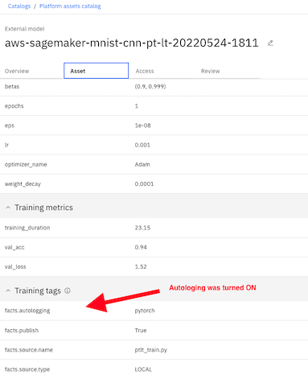

## How to train,deploy in AWS and monitor in WOS Pytorch Lightning model on MNIST dataset

### 1 CNN Pytorch Lighting ⚡️ model

#### 2.2.1 Train locally

In order to benefit from the Autolog feature of in Factsheets client , we have created the same CNN model but trained with a Pytorch Lightning Trainer.

You can invoke [test_train.py](./use_case_ptlt/test_train.py) for Pytorch Lightning model training as follow with the right parameters to trigger [ptlt_train.py](./ptlt_train.py) for this model.

```shell
# python ./use_case_ptlt/test_train.py --model cnn --epochs 10
2022/05/20 14:00:22 INFO : Experiment successfully created with ID 1 and name aws-sagemaker-mnist-cnn-pt-lt-20220520-2000
2022/05/20 14:00:22 INFO : Autolog enabled Successfully
Current Experiment aws-sagemaker-mnist-cnn-pt-lt-20220520-2000 ID 1
INFO:ibm_aigov_facts_client.store.autolog.autolog_utils:Autolog enabled Successfully
rank_zero_warn(Epoch 0:  92%|█████████▏| 860/939 [00:12<00:01, 68.93it/s, loss=1.58, v_num=59]
Validation: 0it [00:00, ?it/s]
Validation DataLoader 0:   0%|          | 0/79 [00:00<?, ?it/s]
Epoch 0:  94%|█████████▎| 880/939 [00:12<00:00, 69.87it/s, loss=1.58, v_num=59]
  rank_zero_warn(
Testing DataLoader 0: 100%|██████████| 157/157 [00:00<00:00, 173.23it/s]
────────────────────────────────────────────────────────────────────────────────────────────────────────────────────────
       Test metric             DataLoader 0
────────────────────────────────────────────────────────────────────────────────────────────────────────────────────────
         val_acc            0.9549999833106995
        val_loss             1.506958246231079
────────────────────────────────────────────────────────────────────────────────────────────────────────────────────────
Saving Pytorch lightning model
Current RunID 8f562f2398a2436eb6a3336519a35634
2022/05/20 14:01:06 INFO : Initiating logging to factsheet for run_id......8f562f2398a2436eb6a3336519a35634
2022/05/20 14:01:06 INFO : Successfully logged results to Factsheet service for run_id 8f562f2398a2436eb6a3336519a35634 under asset_id: 512fb06f-582a-445c-8a84-9f233f55e726
```

#### 2.2.2 Run AWS training job

Once training script [ptlt_train.py](./use_case_ptlt/ptlt_train.py) has been validated locally , it can be executed within an AWS training job in the exact same way as step 2.1.2 with the correct `entry_point` set to  [ptlt_train.py](./use_case/ptlt_train.py)

Once training job status is complete , make sure an output model has been produced.

```bash
# python ./train_sagemaker_job.py --source-dir use_case_ptlt --train-entrypoint ptlt_train.py --prefix DEMO-mnist-pycharm
```

<u>Tip :</u> you can monitor your training job in AWS Cloud Watch

#### 2.2.2 Review Training Facts

1. Make sure that all training facts are properly collected - Auto Log should have captured addtionnal facts



2. Add this model to the model inventory

​	*View all catalogs > Platform Asset Catalog > aws-sagemaker-mnist-cnn-pytorch-Ymd-HM >Asset > Track this model*
