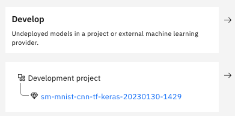
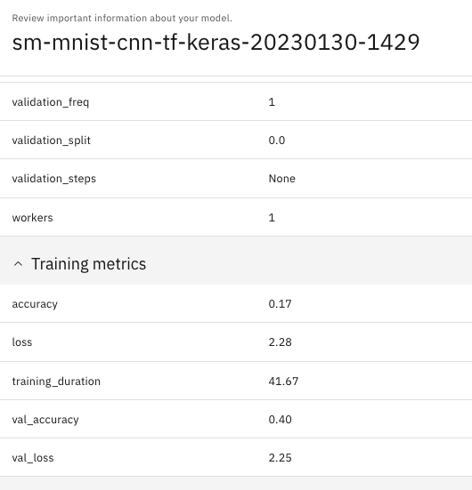
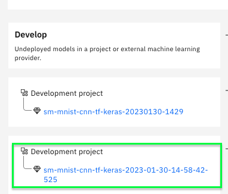
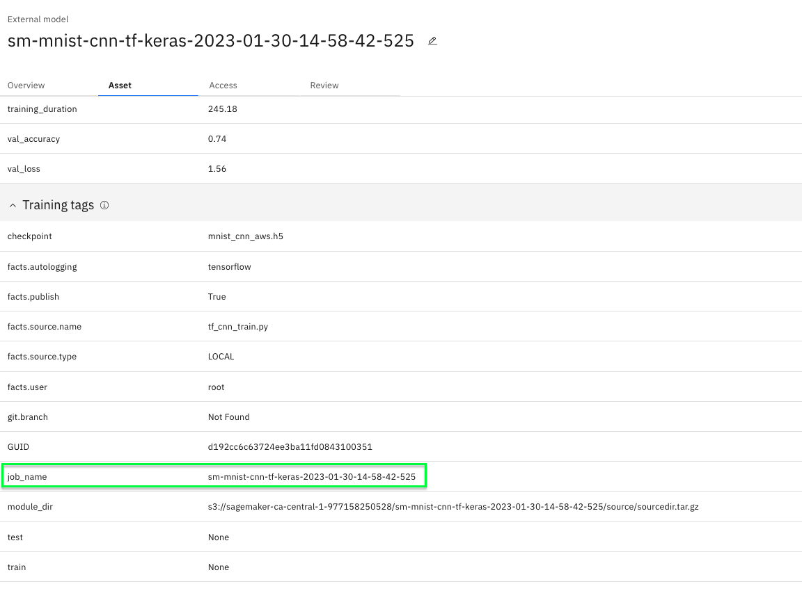
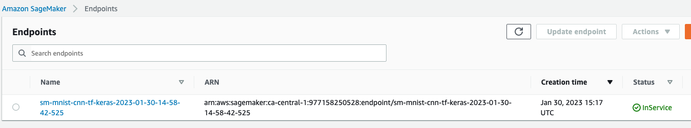
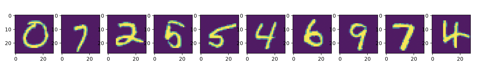
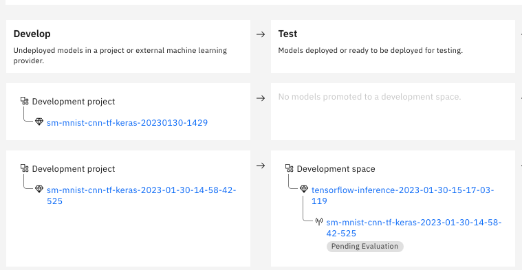
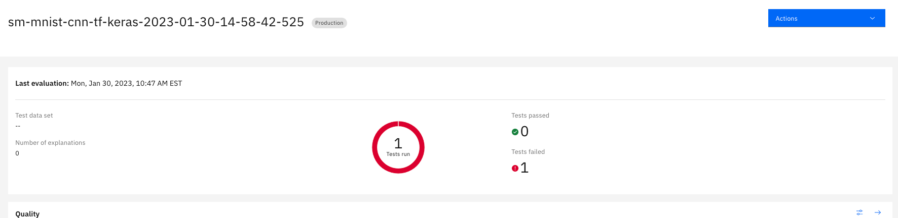

# Handwritten digit detection model use case MNIST dataset

## 1. Model Training & Scoring on local environment

Make sure to run each script within this project's virtual environment and to set the following environment variables :

- `AWS_ACCESS_KEY_ID`: `AKIAXXXXX` your aws key
- `AWS_SECRET_ACCESS_KEY`: `XXXXXX` your credentials
- `AWS_DEFAULT_REGION`: `ca-central-1` your aws region

Make sure to run each script within this project's virtual environment and to set the following environment variables :

a - create a special virtual environment _venv-use-case-mnist-tf_

- python virtual env venv-use-case-mnist-tf for local training and inference can be created as follow
```bash
$ cd <GitHub-directory>
$ python -m venv venv-use-case-mnist-tf
$ source venv-use-case-mnist-tf/bin/activate
(venv-use-case-mnist-tf)
$ pip install -r ./mlmonitor/use_case_mnist_tf requirements.txt
$ pip install -r ./mlmonitor/use_case_mnist_tf requirements-local.txt
```

b - download dataset

**Download and save MNIST dataset**
- Download the mnist test set images from [here](http://yann.lecun.com/exdb/mnist/)
- Save them to `mlmonitor/datasets/mnist/`
- You should have the following files:
  - t10k-images-idx3-ubyte.gz
  - t10k-labels-idx1-ubyte.gz

Note :

- `use_case_mnist_tf` directory is shipped when training and inference is performed in Sagemaker - all dependencies in _requirements.txt_ file are installed in Sagemaker containers.
- dependencies in requirements-local.txt are meant to be installed only in local environment.

c - set the following environment variables in .env file in use_case_mnist_tf directory :

b - set the following environment variables in .env file in use_case_gcr directory :

- `AWS_ACCESS_KEY_ID`: `AKIAXXXXX` your aws key

- `AWS_SECRET_ACCESS_KEY`: `XXXXXX` your credentials

- `AWS_DEFAULT_REGION`: `ca-central-1` your aws region

- `API_KEY` : `XXXXXX` your CP4D credentials


**Example : train model locally** :

- *catalog-id* and *model-entry-id* are be set as script arguments , they are needed to collect model metadata using AI Factsheets.Since AWS models are external models , it requires a *catalog-id* and *model-entry-id* in WKC.
- models trained locally are stored in  _mlmonitor/models/mnist_cnn_aws.h5_ and  _mlmonitor/models/000000001_


```bash
(venv-use-case-mnist-tf)
$ cd <GitHub-directory>/mlmonitor/use_case_mnist_tf
$ python ./test_train.py --catalog-id <my catalog id>  --model-entry-id <my model-entry id>

INFO : Experiment sm-mnist-cnn-tf-keras-20230130-1429 does not exist, creating new experiment
INFO : Experiment successfully created with ID 1 and name sm-mnist-cnn-tf-keras-20230130-1429

Model: "sequential"
_________________________________________________________________
 Layer (type)                Output Shape              Param #
=================================================================
 conv2d (Conv2D)             (None, 26, 26, 32)        320
 conv2d_1 (Conv2D)           (None, 24, 24, 64)        18496
 max_pooling2d (MaxPooling2D  (None, 12, 12, 64)       0
 dropout (Dropout)           (None, 12, 12, 64)        0
 flatten (Flatten)           (None, 9216)              0
 dense (Dense)               (None, 128)               1179776
 dropout_1 (Dropout)         (None, 128)               0
 dense_1 (Dense)             (None, 10)                1290

=================================================================
Total params: 1,199,882
Trainable params: 1,199,882
Non-trainable params: 0
_________________________________________________________________
469/469 [==============================] - ETA: 0s - loss: 2.2836 - accuracy: 0.16672023/01/30 09:29:51 INFO : logging results to factsheet for run_id 5258de48a25c4789b5a957c3695fec92
2023/01/30 09:29:53 INFO : Successfully logged results to Factsheet service for run_id 5258de48a25c4789b5a957c3695fec92 under asset_id: ffa858fa-f802-4803-815e-48d3ec8133b7
469/469 [==============================] - 40s 84ms/step - loss: 2.2836 - accuracy: 0.1667 - val_loss: 2.2512 - val_accuracy: 0.4017
[2.2511520385742188, 0.4016999900341034]
Current RunID 5258de48a25c4789b5a957c3695fec92


[1 rows x 5 columns]
INFO:ibm_aigov_facts_client.export.export_facts:Initiating logging to factsheet for run_id......5258de48a25c4789b5a957c3695fec92
INFO : Initiating logging to factsheet for run_id......5258de48a25c4789b5a957c3695fec92
INFO : Successfully logged results to Factsheet service for run_id 5258de48a25c4789b5a957c3695fec92 under asset_id: ffa858fa-f802-4803-815e-48d3ec8133b7
INFO:ibm_aigov_facts_client.base_classes.auth:Successfully logged results to Factsheet service for run_id 5258de48a25c4789b5a957c3695fec92 under asset_id: ffa858fa-f802-4803-815e-48d3ec8133b7
INFO:ibm_aigov_facts_client.factsheet.external_modelfacts_utility:External model asset saved successfully under asset_id ffb80b77-2359-4ec9-845f-b727acce7855 and catalog 2885333d-637c-49a0-a9ca-23323377a36a
INFO : External model asset saved successfully under asset_id ffb80b77-2359-4ec9-845f-
```

* One Factsheets model asset should be generated in Model use case specified by `--model-entry-id` parameter:

  | 1.develop state                                 |                                  2. training metadata                                   |
  -------------------------------------------------|:---------------------------------------------------------------------------------------:|
  |  |                 |

**Example : test inference locally**

```bash
(venv-use-case-mnist-tf)
$ cd <GitHub-directory>/mlmonitor/use_case_mnist_tf
$ python ./use_case_gcr/test_inference.py --model_type tf-cnn

{"predictions": [{"fields": ["prediction", "prediction_classes", "probability"], "id": "tf_keras_sm_cnn", "values": [[[2.5273653274888056e-17, 9.419956134570917e-13, 3.4938328981561675e-17, 9.457362738471904e-21, 3.7910129435658746e-07, 3.788040194019349e-12, 2.009706149327245e-13, 8.756615766693232e-13, 0.6502713561058044, 0.34972819685935974], 8, [2.5273653274888056e-17, 9.419956134570917e-13, 3.4938328981561675e-17, 9.457362738471904e-21, 3.7910129435658746e-07, 3.788040194019349e-12, 2.009706149327245e-13, 8.756615766693232e-13, 0.6502713561058044, 0.34972819685935974]], [[3.459840445430018e-05, 2.2329686352141283e-19, 6.048200162922512e-09, 1.4562773729964729e-12, 9.124087041456619e-10, 8.223191905187832e-09, 0.00038313292316161096, 8.472014201288403e-09, 0.9995811581611633, 1.0660778571036644e-06], 8, [3.459840445430018e-05, 2.2329686352141283e-19, 6.048200162922512e-09, 1.4562773729964729e-12, 9.124087041456619e-10, 8.223191905187832e-09, 0.00038313292316161096, 8.472014201288403e-09, 0.9995811581611633, 1.0660778571036644e-06]]]}]}
```


## 2. use mlmonitor to "onboard" a new Model

Once training and inference scripts have been validated in local environment, they will be used in Sagemaker training jobs and inference containers to serve an online model endpoint.

For these tasks such as deploy, monitor,govern,evaluate use _venv-mlmonitor_ virtual environment created earlier [here](../Readme.md).

Make sure to run specify in `MONITOR_CONFIG_FILE` environment variable the path to [credentials.cfg](../../credentials.cfg) file in .env file :

if you don't specify a config file , please set the following environment variables (e.g for container):

- `API_KEY`
- `AUTH_ENDPOINT`
- `AWS_ROLE`
- `MODEL_ENTRY_ID`
- `CATALOG_ID`
- `COS_RESOURCE_CRN`
- `COS_ENDPOINT`
- `BUCKET_NAME`
- `IAM_URL`

**Example : train sagemaker job**

Execute *python* command terminal once  *venv-mlmonitor* virtual environment is activated.

```bash
$ source <path to virtual envs>/venv-mlmonitor/bin/activate
(venv-mlmonitor)
$ python
Python 3.10.6
>>> from mlmonitor import SageMakerModelUseCase
>>> source_dir = 'use_case_mnist_tf'
>>> catalog_id = <catalog id>
>>> model_entry_id = <Model use case id for credit risk models>
>>> model_use_case = SageMakerModelUseCase(source_dir,catalog_id,model_entry_id)
>>> model_use_case.train()

{'base_job_name': 'sm-mnist-cnn-tf-keras', 'entry_point': 'tf_cnn_train.py', 'source_dir': '<path to virtual envs>/mlmonitor/use_case_mnist_tf', 'role': 'AmazonSageMaker-ExecutionRole-0000000000000000', 'instance_count': 1, 'instance_type': 'ml.c4.xlarge', 'output_path': 's3://sagemaker-ca-central-1-900000000000/DEMO-mnist-mlmonitor', 'hyperparameters': {'ibm-key-name': 'IBM_API_KEY_MLOPS', 'catalog-id': 'ecee7437-0b57-43ad-a0dd-23c21173aa3f', 'model-entry-id': '8881ef6b-1368-4f29-8f70-3c353a8b742c', 'batch-size': 128, 'epochs': 5}, 'py_version': 'py39', 'framework_version': '2.8.0'}

INFO - Train model
with role :
[AmazonSageMaker-ExecutionRole-00000000000]
custom train :
[True]
deploy model :
[False]
train entrypoint :
[tf_cnn_train.py]
source_dir :
[<path to virtual envs>/mlmonitor/use_case_mnist_tf]
Model use case id [8881ef6b-1368-4f29-8f70-3c353a8b742c]
catalog id [ecee7437-0b57-43ad-a0dd-23c21173aa3f]
ibm key name [IBM_API_KEY_MLOPS]
AWS Region [ca-central-1]
SM version [2.103.0]

INFO - Model artifact produced by training job s3://sagemaker-ca-central-1-977158250528/DEMO-mnist-mlmonitor/sm-mnist-cnn-tf-keras-2023-01-30-14-58-42-525/output/model.tar.gz

>>> model_use_case.display_states()

              - trained:   [True]
              - deployed:  [False]
              - governed:  [False]
              - monitored: [False]
```

- A model asset was created with AI Factsheets client in the Model use case identified by  *catalog-id* and *model-entry-id* with the same name as Sagemaker jobname


  | 1.develop state (sagemaker job)                                        |                                 2. training metadata  (sagemaker job)                                  |
------------------------------------------------------------------------|:------------------------------------------------------------------------------------------------------:|
  |  |                                                                            |


**Example : deploy aws endpoint**

```bash
>>> model_use_case.deploy()

2023-01-30 10:16:47,597 - botocore.credentials - INFO - Found credentials in environment variables.
2023-01-30 10:16:48,162 - botocore.credentials - INFO - Found credentials in environment variables.
763104351884.dkr.ecr.ca-central-1.amazonaws.com/tensorflow-inference:2.8.0-cpu
2023-01-30 10:16:48,382 - mlmonitor.src - INFO - endpoint name :[sm-mnist-cnn-tf-keras-2023-01-30-14-58-42-525]
ibm key name :[IBM_API_KEY_MLOPS]
model data  :[s3://sagemaker-ca-central-1-977158250528/DEMO-mnist-mlmonitor/sm-mnist-cnn-tf-keras-2023-01-30-14-58-42-525/output/model.tar.gz]
container  :[763104351884.dkr.ecr.ca-central-1.amazonaws.com/tensorflow-inference:2.8.0-cpu]
region  :[ca-central-1]

INFO - model_params:
{
	"model_data": "s3://sagemaker-ca-central-1-000000000000/DEMO-mnist-mlmonitor/sm-mnist-cnn-tf-keras-2023-01-30-14-58-42-525/output/model.tar.gz",
	"source_dir": "/use_case_mnist_tf",
	"image_uri": "763104351884.dkr.ecr.ca-central-1.amazonaws.com/tensorflow-inference:2.8.0-cpu",
	"role": "AmazonSageMaker-ExecutionRole",
	"entry_point": "tf_cnn_inference.py",
	"framework_version": "2.8.0",
	"container_log_level": [
		20
	]
}
INFO - Deploying inference Endpoint sm-mnist-cnn-tf-keras-2023-01-30-14-58-42-525 to AWS
INFO - Creating model with name: tensorflow-inference-2023-01-30-15-17-03-119
INFO - Creating endpoint-config with name sm-mnist-cnn-tf-keras-2023-01-30-14-58-42-525
INFO - Creating endpoint with name sm-mnist-cnn-tf-keras-2023-01-30-14-58-42-525
-----!

>>> model_use_case.display_states()

              - trained:   [True]
              - deployed:  [True]
              - governed:  [False]
              - monitored: [False]
```

  | Endpoint deployed                                 |
---------------------------------------------------|
  |  |

**Example : score sagemaker endpoint**

```bash
>>> model_use_case.score_model()
INFO - EndpointName used for inference: sm-gcr-scikit-2022-11-20-14-58-59-334
response_time 229ms

{
	'fields': ['prediction', 'probability'],
	'values': [
		[0, [0.628858685, 0.0133923851, 0.0472228192, ...]],
		[7, [0.0439698249, 0.114419691, 0.0613043196, ...]],
		[2, [0.130367726, 0.0337299369, 0.302612841, ...]],
		[4, [0.0892995372, 0.0406049974, 0.0764350593, ...]],
		[5, [0.112628087, 0.076756306, 0.0620768853, ...]],
		[4, [0.0712190419, 0.0392970555, 0.0645717308,...]],
		[6, [0.0770954862, 0.0453048572, 0.105464429, ...]],
		[9, [0.0356274843, 0.0679512322, 0.0546309724,...]],
		[7, [0.0292026419, 0.0995339751, 0.080454506,...]],
		[4, [0.0685981, 0.0515882485, 0.130488992, ...]]
	]
}

```

  | scoring input data                                 |
----------------------------------------------------|
  |  |


- Sends payload example to online model

**Example : Update AI Factsheets deployment details **

```bash
>>> model_use_case.govern()

INFO :  Experiment sm-mnist-cnn-tf-keras-2023-01-30-14-58-42-525 does not exist, creating new experiment
INFO : Experiment successfully created with ID 1 and name sm-mnist-cnn-tf-keras-2023-01-30-14-58-42-525
INFO : Manual tracing initiated successfully under run cb674ee7065b49628404f5755872189f
INFO : logging results to factsheet for run_id cb674ee7065b49628404f5755872189f
INFO : Successfully logged results to Factsheet service for run_id cb674ee7065b49628404f5755872189f under asset_id: 6211f122-caac-4eb8-a1ff-f7855d06d4da
INFO : External model asset saved successfully under asset_id ebcb4bdd-c4f2-4f27-b3c4-20682524674b and catalog 2885333d-637c-49a0-a9ca-23323377a36a
INFO : Initiate linking model to existing model entry 8881ef6b-1368-4f29-8f70-3c353a8b742c......
INFO : Successfully finished linking Model ebcb4bdd-c4f2-4f27-b3c4-20682524674b to Model Entry
https://api.dataplatform.cloud.ibm.com/v1/aigov/model_inventory/model_entries/8881ef6b-1368-4f29-8f70-3c353a8b742c/models?catalog_id=ecee7437-0b57-43ad-a0dd-23c21173aa3f&allow_metadata_on_dpr_deny=true
['ebcb4bdd-c4f2-4f27-b3c4-20682524674b']

INFO : Successfully logged results to Factsheet service for run_id under asset_id: 76d6b

>>> model_use_case.display_states()

              - trained:   [True]
              - deployed:  [True]
              - governed:  [True]
              - monitored: [False]
```

Model assets moved to deployed state :

| deploy state in Factsheets                                    |
---------------------------------------------------------------|
  |  |


**Example : Create WOS subscription for credit risk model**

```bash
>>> model_use_case.monitor()

=============================================================================

 Waiting for end of adding subscription c8a1e716-01d8-409c-a788-3fc6727f60a7

=============================================================================


active

-------------------------------------------
 Successfully finished adding subscription
-------------------------------------------


(2, 28, 28, 1) float32
1 subscriptions found for sm-mnist-cnn-tf-keras-2023-01-30-14-58-42-525 - picked [c8a1e716-01d8-409c-a788-3fc6727f60a7]

---------------------------------------
 Successfully finished storing records
---------------------------------------


                      --- Schema of a8658751-0ff4-42fc-bda3-08ee1b74c496 data set ---
╒════════════════════════╤══════════════════════════════════════════════════════════════════╤════════════╕
│ name                   │ type                                                             │ nullable   │
╞════════════════════════╪══════════════════════════════════════════════════════════════════╪════════════╡
│ scoring_id             │ string                                                           │ False      │
├────────────────────────┼──────────────────────────────────────────────────────────────────┼────────────┤
│ scoring_timestamp      │ timestamp                                                        │ False      │
├────────────────────────┼──────────────────────────────────────────────────────────────────┼────────────┤
│ deployment_id          │ string                                                           │ False      │
├────────────────────────┼──────────────────────────────────────────────────────────────────┼────────────┤
│ asset_revision         │ string                                                           │ True       │
├────────────────────────┼──────────────────────────────────────────────────────────────────┼────────────┤
│ scoring_input          │ binary                                                           │ True       │
├────────────────────────┼──────────────────────────────────────────────────────────────────┼────────────┤
│ prediction             │ integer                                                          │ True       │
├────────────────────────┼──────────────────────────────────────────────────────────────────┼────────────┤
│ probability            │ {'containsNull': True, 'elementType': 'double', 'type': 'array'} │ True       │
├────────────────────────┼──────────────────────────────────────────────────────────────────┼────────────┤
│ prediction_probability │ double                                                           │ True       │
╘════════════════════════╧══════════════════════════════════════════════════════════════════╧════════════╛
```

- `use_case_mnist_tf`: `source_dir` contains all `model_signature.json` file used to configue model  monitoring , you can enable and/or update monitors definitions prior to execute `configure_wos_subscription.py`

  here below is an example of Quality monitor configuration :

  ```json
  {
		"enabled": true,
		"parameters": {
			"min_feedback_data_size": 10
		},
		"thresholds": [{
			"metric_id": "accuracy",
			"type": "lower_limit",
			"lower_limit": 0.80
		}]
	}
  ```

**Example : run payload logging**


```bash
>>> model_use_case.log_payload()


1 subscriptions found for sm-mnist-cnn-tf-keras-2023-01-30-14-58-42-525 - picked [c8a1e716-01d8-409c-a788-3fc6727f60a7]


==========================================================================================

 Waiting for end of storing records with request id: 04525ece-4249-4e68-b42b-66e89706c0c3

==========================================================================================


---------------------------------------
 Successfully finished storing records
---------------------------------------
```

**Example : create quality monitor**

```bash
>>> model_use_case.configure_quality_monitor()

===================================================================================

 Waiting for end of monitor instance creation dac352b8-3ee1-4a56-93e5-6707c95a4c2d

===================================================================================

---------------------------------------
 Monitor instance successfully created
---------------------------------------

{'quality': 'dac352b8-3ee1-4a56-93e5-6707c95a4c2d', 'mrm': '8218dfe1-968c-4922-978d-708a3b756a9c'}
```

**Example : run feedback logging**

```bash
>>> model_use_case.log_feedback()

==========================================================================================

 Waiting for end of storing records with request id: 1ed32048-6eae-4d08-9fbe-cdd6eb687de5

==========================================================================================

---------------------------------------
 Successfully finished storing records
---------------------------------------
```

**Example : Evaluate models in Watson OpensSale**

```bash
>>> model_use_case.evaluate()

INFO:mlmonitor.src:Run quality Monitor evaluation started at 30/01/2023 10:44:22


========================================================================

 Waiting for end of monitoring run 8c8753f0-a529-433a-aeab-32efc64d11ba

========================================================================


running
finished

---------------------------
 Successfully finished run
---------------------------

```

- A minimum required number of samples must be logged prior to perform an evaluation

  | Watson OpenScale Subscription with evaluation              |
  | ---------------------------------------------------------- |
  |  |


**Example : Delete all resources created earlier**

```bash
>>> model_use_case.cleanup()

INFO:mlmonitor.src:deleting [aws] resources for [sm-mnist-cnn-tf-keras-2023-01-30-14-58-42-525]...

INFO:mlmonitor.src:Model asset [ebcb4bdd-c4f2-4f27-b3c4-20682524674b] for deployment [sm-mnist-cnn-tf-keras-2023-01-30-14-58-42-525] unlinked from catalog_id [ecee7437-0b57-43ad-a0dd-23c21173aa3f] model_entry_id [8881ef6b-1368-4f29-8f70-3c353a8b742c]
INFO:mlmonitor.src:Model asset [ebcb4bdd-c4f2-4f27-b3c4-20682524674b] for deployment [sm-mnist-cnn-tf-keras-2023-01-30-14-58-42-525] Deleted
{'serving': 1, 'wos': 1, 'factsheets': 1}
```

Number of resources deleted is returned

- AWS resources are cleanup up properly (Endpoint,Endpoint Config and Model).

- Watson OpenScale subscription is deleted.

- AI Factsheets model assets are removed from Model use case and deleted.
